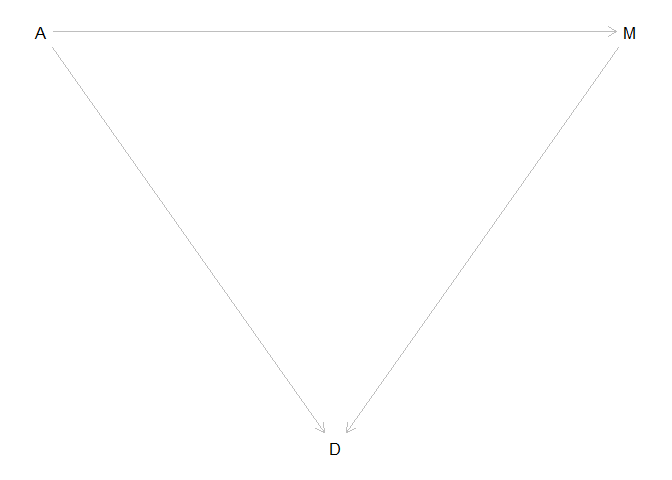
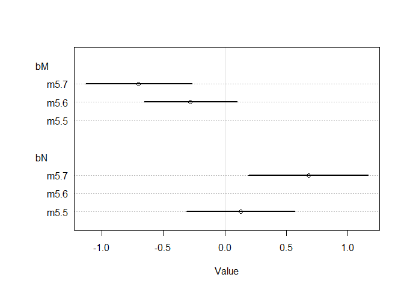

# Chapter 5: The Many Variables & The Spurious Waffles
## 5.1. Spurious association


```r
# load data and copy
library(rethinking)
```

```
## Loading required package: rstan
```

```
## Loading required package: ggplot2
```

```
## Loading required package: StanHeaders
```

```
## rstan (Version 2.18.2, GitRev: 2e1f913d3ca3)
```

```
## For execution on a local, multicore CPU with excess RAM we recommend calling
## options(mc.cores = parallel::detectCores()).
## To avoid recompilation of unchanged Stan programs, we recommend calling
## rstan_options(auto_write = TRUE)
```

```
## For improved execution time, we recommend calling
## Sys.setenv(LOCAL_CPPFLAGS = '-march=native')
## although this causes Stan to throw an error on a few processors.
```

```
## Loading required package: parallel
```

```
## rethinking (Version 1.88)
```

```r
data(WaffleDivorce)
d <- WaffleDivorce
# standardize variables
d$A <- scale( d$MedianAgeMarriage )
d$D <- scale( d$Divorce )
```


```r
sd( d$MedianAgeMarriage )
```

```
## [1] 1.24363
```


```r
m5.1 <- quap(
alist(
D ~ dnorm( mu , sigma ) ,
mu <- a + bA * A ,
a ~ dnorm( 0 , 0.2 ) ,
bA ~ dnorm( 0 , 0.5 ) ,
sigma ~ dexp( 1 )
) , data = d )

set.seed(10)
prior <- extract.prior( m5.1 )
mu <- link( m5.1 , post=prior , data=list( A=c(-2,2) ) )
plot( NULL , xlim=c(-2,2) , ylim=c(-2,2) )
for ( i in 1:50 ) lines( c(-2,2) , mu[i,] , col=col.alpha("black",0.4) )
```

<!-- -->


```r
# compute percentile interval of mean
A_seq <- seq( from=-3 , to=3.2 , length.out=30 )
mu <- link( m5.1 , data=list(A=A_seq) )
mu.mean <- apply( mu , 2, mean )
mu.PI <- apply( mu , 2 , PI )
# plot it all
plot( D ~ A , data=d , col=rangi2 )
lines( A_seq , mu.mean , lwd=2 )
shade( mu.PI , A_seq )
```

<!-- -->

```r
precis(m5.1)
```

```
##                mean         sd       5.5%      94.5%
## a     -7.761625e-06 0.09738205 -0.1556431  0.1556276
## bA    -5.684297e-01 0.11000419 -0.7442377 -0.3926218
## sigma  7.883605e-01 0.07801988  0.6636697  0.9130513
```


```r
d$M <- scale( d$Marriage )
m5.2 <- quap(
alist(
D ~ dnorm( mu , sigma ) ,
mu <- a + bM * M ,
a ~ dnorm( 0 , 0.2 ) ,
bM ~ dnorm( 0 , 0.5 ) ,
sigma ~ dexp( 1 )
) , data = d )
M_seq <- seq( from=-3 , to=3.2 , length.out=30 )
mu <- link( m5.2 , data=list(M=M_seq) )
mu.mean <- apply( mu , 2, mean )
mu.PI <- apply( mu , 2 , PI )
# plot it all
plot( D ~ M , data=d , col=rangi2 )
lines( M_seq , mu.mean , lwd=2 )
shade( mu.PI , M_seq )
```

<!-- -->

```r
precis(m5.2)
```

```
##               mean         sd       5.5%     94.5%
## a     2.918047e-07 0.10824642 -0.1729984 0.1729990
## bM    3.500540e-01 0.12592744  0.1487977 0.5513104
## sigma 9.102653e-01 0.08986239  0.7666479 1.0538828
```

### 5.1.1 Think before you regress

```r
#install.packages('dagitty')
library(dagitty)
dag5.1 <- dagitty( "dag {
A -> D
A -> M
M -> D
}")
coordinates(dag5.1) <- list( x=c(A=0,D=1,M=2) , y=c(A=0,D=1,M=0) )
plot( dag5.1 )
```

<!-- -->

```r
plot(graphLayout(dag5.1))
```

<!-- -->

### 5.1.2. Multiple regression notation

### 5.1.3. Approximating the posterior


```r
m5.3 <- quap(
alist(
D ~ dnorm( mu , sigma ) ,
mu <- a + bM*M + bA*A ,
a ~ dnorm( 0 , 0.2 ) ,
bM ~ dnorm( 0 , 0.5 ) ,
bA ~ dnorm( 0 , 0.5 ) ,
sigma ~ dexp( 1 )
) , data = d )
precis( m5.3 )
```

```
##                mean         sd       5.5%      94.5%
## a      6.145791e-06 0.09707503 -0.1551385  0.1551508
## bM    -6.539899e-02 0.15077111 -0.3063603  0.1755624
## bA    -6.135264e-01 0.15098166 -0.8548242 -0.3722285
## sigma  7.851074e-01 0.07784077  0.6607028  0.9095120
```


```r
plot( coeftab(m5.1,m5.2,m5.3), par=c("bA","bM") )
```

<!-- -->


```r
N <- 50 # number of simulated States
age <- rnorm( N ) # sim A
mar <- rnorm( N , age ) # sim A -> M
div <- rnorm( N , age ) # sim A -> D
```
### 5.1.4. Plotting multivariate posteriors
### 5.1.4.1. Predictor residual plots


```r
m5.4 <- quap(
alist(
M ~ dnorm( mu , sigma ) ,
mu <- a + bAM * A ,
a ~ dnorm( 0 , 0.2 ) ,
bAM ~ dnorm( 0 , 0.5 ) ,
sigma ~ dexp( 1 )
) , data = d )
mu <- link(m5.4)
mu_mean <- apply( mu , 2 , mean )
mu_resid <- d$M - mu_mean
mu_resid
```

```
##              [,1]
##  [1,] -0.40106678
##  [2,]  1.07026072
##  [3,] -0.09558616
##  [4,]  0.67311136
##  [5,]  0.14675084
##  [6,]  0.69115347
##  [7,]  0.06678530
##  [8,]  1.08830283
##  [9,]  1.39719845
## [10,] -0.62950577
## [11,]  0.43418935
## [12,]  1.72973847
## [13,] -0.09900116
## [14,] -0.05755266
## [15,] -0.28306774
## [16,] -0.00294278
## [17,] -0.06828122
## [18,] -0.15361104
## [19,]  0.03923481
## [20,] -1.55106636
## [21,]  0.21525874
## [22,]  0.22696193
## [23,] -0.76115728
## [24,] -1.13295098
## [25,] -0.35888919
## [26,] -0.65486143
## [27,] -0.62536167
## [28,] -0.50321853
## [29,] -0.48517642
## [30,] -0.48298160
## [31,] -0.06925586
## [32,]  0.43443490
## [33,] -0.12508592
## [34,]  1.31040290
## [35,] -0.71166613
## [36,]  0.04435355
## [37,] -0.35255027
## [38,] -0.63364986
## [39,] -0.15117068
## [40,] -0.33987244
## [41,] -0.25990689
## [42,] -0.66753927
## [43,] -0.11460291
## [44,]  0.95738041
## [45,] -0.50833727
## [46,]  0.29205483
## [47,]  0.24987723
## [48,] -0.04195092
## [49,] -0.63267523
## [50,]  1.74948431
## attr(,"scaled:center")
## [1] 20.114
## attr(,"scaled:scale")
## [1] 3.797905
```

#### 5.1.4.2. Counterfactual plots

```r
# prepare new counterfactual data
M_seq <- seq( from=-2 , to=3 , length.out=30 )
pred_data <- data.frame( M = M_seq , A = 0 )
# compute counterfactual mean divorce (mu)
mu <- link( m5.3 , data=pred_data )
mu_mean <- apply( mu , 2 , mean )
mu_PI <- apply( mu , 2 , PI )
# simulate counterfactual divorce outcomes
D_sim <- sim( m5.3 , data=pred_data , n=1e4 )
D_PI <- apply( D_sim , 2 , PI )
# display predictions, hiding raw data with type="n"
plot( D ~ M , data=d , type="n" )
mtext( "Median age marriage (std) = 0" )
lines( M_seq , mu_mean )
shade( mu_PI , M_seq )
shade( D_PI , M_seq )
```

<!-- -->


#### 5.1.4.3. Posterior prediction plots.


```r
# call link without specifying new data
# so it uses original data
mu <- link( m5.3 )
# summarize samples across cases
mu_mean <- apply( mu , 2 , mean )
mu_PI <- apply( mu , 2 , PI )
# simulate observations
# again no new data, so uses original data
D_sim <- sim( m5.3 , n=1e4 )
D_PI <- apply( D_sim , 2 , PI )

plot( mu_mean ~ d$D , col=rangi2 , ylim=range(mu_PI) ,
xlab="Observed divorce" , ylab="Predicted divorce" )
abline( a=0 , b=1 , lty=2 )
for ( i in 1:nrow(d) ) lines( rep(d$D[i],2) , mu_PI[,i] , col=rangi2 )
identify( x=d$D , y=mu_mean , labels=d$Loc )
```

<!-- -->

```
## integer(0)
```


```r
N <- 100 # number of cases
x_real <- rnorm( N ) # x_real as Gaussian with mean 0 and stddev 1
x_spur <- rnorm( N , x_real ) # x_spur as Gaussian with mean=x_real
y <- rnorm( N , x_real ) # y as Gaussian with mean=x_real
d <- data.frame(y,x_real,x_spur) # bind all together in data frame
pairs(d)
```

<!-- -->

## 5.2. Masked relationship


```r
library(rethinking)
data(milk)
d <- milk
str(d)
```

```
## 'data.frame':	29 obs. of  8 variables:
##  $ clade         : Factor w/ 4 levels "Ape","New World Monkey",..: 4 4 4 4 4 2 2 2 2 2 ...
##  $ species       : Factor w/ 29 levels "A palliata","Alouatta seniculus",..: 11 8 9 10 16 2 1 6 28 27 ...
##  $ kcal.per.g    : num  0.49 0.51 0.46 0.48 0.6 0.47 0.56 0.89 0.91 0.92 ...
##  $ perc.fat      : num  16.6 19.3 14.1 14.9 27.3 ...
##  $ perc.protein  : num  15.4 16.9 16.9 13.2 19.5 ...
##  $ perc.lactose  : num  68 63.8 69 71.9 53.2 ...
##  $ mass          : num  1.95 2.09 2.51 1.62 2.19 5.25 5.37 2.51 0.71 0.68 ...
##  $ neocortex.perc: num  55.2 NA NA NA NA ...
```


```r
d$K <- scale( d$kcal.per.g )
d$N <- scale( d$neocortex.perc )
d$M <- scale( log(d$mass) )
```


```r
m5.5_draft <- quap(
alist(
K ~ dnorm( mu , sigma ) ,
mu <- a + bN*N ,
a ~ dnorm( 0 , 1 ) ,
bN ~ dnorm( 0 , 1 ) ,
sigma ~ dexp( 1 )
) , data=d )
```

```
## Error in quap(alist(K ~ dnorm(mu, sigma), mu <- a + bN * N, a ~ dnorm(0, : initial value in 'vmmin' is not finite
## The start values for the parameters were invalid. This could be caused by missing values (NA) in the data or by start values outside the parameter constraints. If there are no NA values in the data, try using explicit start values.
```


```r
d$neocortex.perc
```

```
##  [1] 55.16    NA    NA    NA    NA 64.54 64.54 67.64    NA 68.85 58.85
## [12] 61.69 60.32    NA    NA 69.97    NA 70.41    NA 73.40    NA 67.53
## [23]    NA 71.26 72.60    NA 70.24 76.30 75.49
```


```r
dcc <- d[ complete.cases(d$K,d$N,d$M) , ]
m5.5_draft <- quap(
alist(
K ~ dnorm( mu , sigma ) ,
mu <- a + bN*N ,
a ~ dnorm( 0 , 1 ) ,
bN ~ dnorm( 0 , 1 ) ,
sigma ~ dexp( 1 )
) , data=dcc )

prior <- extract.prior( m5.5_draft )
xseq <- c(-2,2)
mu <- link( m5.5_draft , post=prior , data=list(N=xseq) )
plot( NULL , xlim=xseq , ylim=xseq )
for ( i in 1:50 ) lines( xseq , mu[i,] , col=col.alpha("black",0.3) )
```

<!-- -->

```r
m5.5 <- quap(
alist(
K ~ dnorm( mu , sigma ) ,
mu <- a + bN*N ,
a ~ dnorm( 0 , 0.2 ) ,
bN ~ dnorm( 0 , 0.5 ) ,
sigma ~ dexp( 1 )
) , data=dcc )
precis(m5.5)
```

```
##             mean        sd       5.5%     94.5%
## a     0.03994016 0.1544907 -0.2069659 0.2868462
## bN    0.13323434 0.2237468 -0.2243562 0.4908249
## sigma 0.99981984 0.1647079  0.7365849 1.2630548
```

```r
prior <- extract.prior( m5.5 )
xseq <- c(-2,2)
mu <- link( m5.5, post=prior , data=list(N=xseq) )
plot( NULL , xlim=xseq , ylim=xseq )
for ( i in 1:50 ) lines( xseq , mu[i,] , col=col.alpha("black",0.3) )
```

<!-- -->


```r
xseq <- seq( from=min(dcc$N)-0.15 , to=max(dcc$N)+0.15 , length.out=30 )
mu <- link( m5.5 , data=list(N=xseq) )
mu_mean <- apply(mu,2,mean)
mu_PI <- apply(mu,2,PI)
plot( K ~ N , data=dcc )
lines( xseq , mu_mean , lwd=2 )
shade( mu_PI , xseq )
```

<!-- -->


```r
m5.6 <- quap(
alist(
K ~ dnorm( mu , sigma ) ,
mu <- a + bM*M ,
a ~ dnorm( 0 , 0.2 ) ,
bM ~ dnorm( 0 , 0.5 ) ,
sigma ~ dexp( 1 )
) , data=dcc )
precis(m5.6)
```

```
##              mean        sd       5.5%      94.5%
## a      0.04656823 0.1512833 -0.1952118 0.28834823
## bM    -0.28253832 0.1928907 -0.5908149 0.02573827
## sigma  0.94933101 0.1570827  0.6982825 1.20037955
```


```r
xseq <- seq( from=min(dcc$M)-0.15 , to=max(dcc$M)+0.15 , length.out=30 )
mu <- link( m5.6 , data=list(M=xseq) )
mu_mean <- apply(mu,2,mean)
mu_PI <- apply(mu,2,PI)
plot( K ~ M , data=dcc )
lines( xseq , mu_mean , lwd=2 )
shade( mu_PI , xseq )
```

<!-- -->


```r
m5.7 <- quap(
alist(
K ~ dnorm( mu , sigma ) ,
mu <- a + bN*N + bM*M ,
a ~ dnorm( 0 , 0.2 ) ,
bN ~ dnorm( 0 , 0.5 ) ,
bM ~ dnorm( 0 , 0.5 ) ,
sigma ~ dexp( 1 )
) , data=dcc )
precis(m5.7)
```

```
##              mean        sd       5.5%      94.5%
## a      0.06801219 0.1339996 -0.1461451  0.2821695
## bN     0.67507766 0.2483051  0.2782381  1.0719172
## bM    -0.70295512 0.2207930 -1.0558249 -0.3500853
## sigma  0.73802751 0.1324676  0.5263187  0.9497363
```


```r
plot( coeftab( m5.5 , m5.6 , m5.7 ) , pars=c("bM","bN") )
```

<!-- -->


```r
pairs( ~K + M + N ,dcc )
```

<!-- -->


```r
xseq <- seq( from=min(dcc$M)-0.15 , to=max(dcc$M)+0.15 , length.out=30 )
mu <- link( m5.7 , data=data.frame( M=xseq , N=0 ) )
mu_mean <- apply(mu,2,mean)
mu_PI <- apply(mu,2,PI)
plot( NULL , xlim=range(dcc$M) , ylim=range(dcc$K) )
lines( xseq , mu_mean , lwd=2 )
shade( mu_PI , xseq )
```

<!-- -->


```r
xseq <- seq( from=min(dcc$N)-0.15 , to=max(dcc$N)+0.15 , length.out=30 )
mu <- link( m5.7 , data=data.frame( N=xseq , M=0 ) )
mu_mean <- apply(mu,2,mean)
mu_PI <- apply(mu,2,PI)
plot( NULL , xlim=range(dcc$N) , ylim=range(dcc$K) )
lines( xseq , mu_mean , lwd=2 )
shade( mu_PI , xseq )
```

<!-- -->


```r
# M -> K <- N
# M -> N
n <- 100
M <- rnorm( n )
N <- rnorm( n , M )
K <- rnorm( n , N - M )
d_sim <- data.frame(K=K,N=N,M=M)

# M -> K <- N
# N -> M
n <- 100
N <- rnorm( n )
M <- rnorm( n , N )
K <- rnorm( n , N - M )
d_sim2 <- data.frame(K=K,N=N,M=M)
# M -> K <- N
# M <- U -> N
n <- 100
U <- rnorm( n )
N <- rnorm( n , U )
M <- rnorm( n , U )
K <- rnorm( n , N - M )
d_sim3 <- data.frame(K=K,N=N,M=M)
```

## 5.3 Categorical variables
### 5.3.1. Binary categories

```r
data(Howell1)
d <- Howell1
str(d)
```

```
## 'data.frame':	544 obs. of  4 variables:
##  $ height: num  152 140 137 157 145 ...
##  $ weight: num  47.8 36.5 31.9 53 41.3 ...
##  $ age   : num  63 63 65 41 51 35 32 27 19 54 ...
##  $ male  : int  1 0 0 1 0 1 0 1 0 1 ...
```


```r
mu_female <- rnorm(1e4,178,20)
mu_male <- rnorm(1e4,178,20) + rnorm(1e4,0,10)
precis( data.frame( mu_female , mu_male ) )
```

```
##               mean       sd     5.5%    94.5%
## mu_female 177.6184 19.96599 146.1034 209.6122
## mu_male   178.2419 22.43048 142.2101 213.8120
##                                                                          histogram
## mu_female         <U+2581><U+2581><U+2583><U+2587><U+2587><U+2582><U+2581><U+2581>
## mu_male   <U+2581><U+2581><U+2581><U+2583><U+2587><U+2587><U+2583><U+2581><U+2581>
```


```r
d$sex <- ifelse( d$male==1 , 2 , 1 )
str( d$sex )
```

```
##  num [1:544] 2 1 1 2 1 2 1 2 1 2 ...
```


```r
m5.8 <- quap(
alist(
height ~ dnorm( mu , sigma ) ,
mu <- a[sex] ,
a[sex] ~ dnorm( 178 , 20 ) ,
sigma ~ dunif( 0 , 50 )
) , data=d )
precis( m5.8 , depth=2 )
```

```
##            mean        sd      5.5%     94.5%
## a[1]  134.90849 1.6069813 132.34022 137.47676
## a[2]  142.57665 1.6975235 139.86368 145.28962
## sigma  27.31079 0.8281049  25.98732  28.63426
```


```r
post <- extract.samples(m5.8)
post$diff_fm <- post$a[,1] - post$a[,2]
precis( post , depth=2 )
```

```
##               mean        sd      5.5%      94.5%
## sigma    27.316448 0.8261829  26.00487  28.631598
## a[1]    134.914882 1.6036899 132.34964 137.461066
## a[2]    142.587416 1.7021157 139.84758 145.309423
## diff_fm  -7.672534 2.3429402 -11.46112  -3.969188
##                                                                                                                histogram
## sigma   <U+2581><U+2581><U+2581><U+2581><U+2583><U+2585><U+2587><U+2587><U+2583><U+2582><U+2581><U+2581><U+2581><U+2581>
## a[1]            <U+2581><U+2581><U+2581><U+2581><U+2582><U+2585><U+2587><U+2587><U+2585><U+2582><U+2581><U+2581><U+2581>
## a[2]    <U+2581><U+2581><U+2581><U+2581><U+2583><U+2585><U+2587><U+2587><U+2583><U+2582><U+2581><U+2581><U+2581><U+2581>
## diff_fm                                 <U+2581><U+2581><U+2581><U+2582><U+2587><U+2587><U+2583><U+2581><U+2581><U+2581>
```

### 5.3.2. Many categories

```r
data(milk)
d <- milk
unique(d$clade)
```

```
## [1] Strepsirrhine    New World Monkey Old World Monkey Ape             
## Levels: Ape New World Monkey Old World Monkey Strepsirrhine
```


```r
d$clade_id <- as.integer( d$clade )
d$K <- scale( d$kcal.per.g )
m5.9 <- quap(
alist(
K ~ dnorm( mu , sigma ),
mu <- a[clade_id],
a[clade_id] ~ dnorm( 0 , 0.5 ),
sigma ~ dexp( 1 )
) , data=d )
labels <- paste( "a[" , 1:4 , "]:" , levels(d$clade) , sep="" )
plot( precis( m5.9 , depth=2 , pars="a" ) , labels=labels ,
xlab="expected kcal (std)" )
```

<!-- -->


```r
set.seed(63)
d$house <- sample( rep(1:4,each=8) , size=nrow(d) )
m5.10 <- quap(
alist(
K ~ dnorm( mu , sigma ),
mu <- a[clade_id] + h[house],
a[clade_id] ~ dnorm( 0 , 0.5 ),
h[house] ~ dnorm( 0 , 0.5 ),
sigma ~ dexp( 1 )
) , data=d )
labels <- paste( "a[" , 1:4 , "]:" , d$house , sep="" )
plot( precis( m5.9 , depth=2 , pars="a" ) , labels=labels ,
xlab="expected kcal (std)" )
```

<!-- -->


