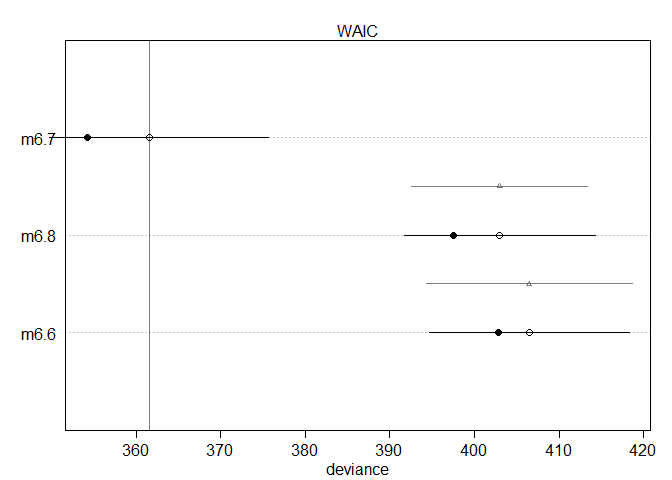
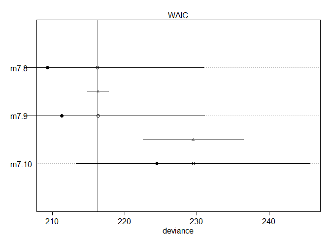
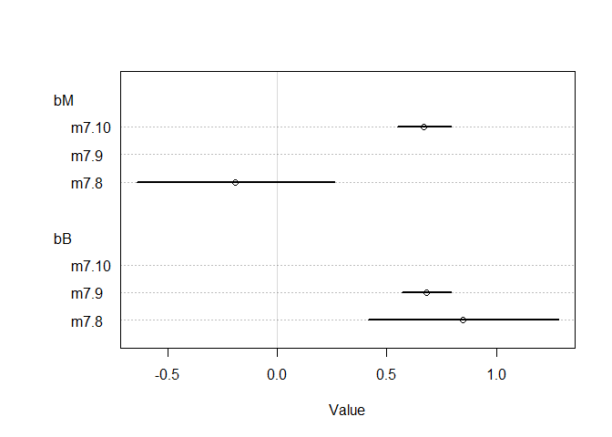
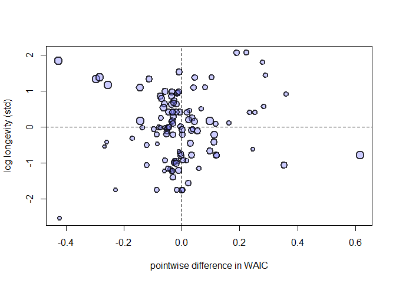

```r
library(tidyverse)
```

```
## -- Attaching packages ------------------------------------------------------- tidyverse 1.2.1 --
```

```
## v ggplot2 3.1.1     v purrr   0.3.2
## v tibble  2.1.3     v dplyr   0.8.1
## v tidyr   0.8.3     v stringr 1.4.0
## v readr   1.3.1     v forcats 0.4.0
```

```
## -- Conflicts ---------------------------------------------------------- tidyverse_conflicts() --
## x dplyr::filter() masks stats::filter()
## x dplyr::lag()    masks stats::lag()
```

```r
library(rethinking)
```

```
## Loading required package: rstan
```

```
## Loading required package: StanHeaders
```

```
## rstan (Version 2.18.2, GitRev: 2e1f913d3ca3)
```

```
## For execution on a local, multicore CPU with excess RAM we recommend calling
## options(mc.cores = parallel::detectCores()).
## To avoid recompilation of unchanged Stan programs, we recommend calling
## rstan_options(auto_write = TRUE)
```

```
## For improved execution time, we recommend calling
## Sys.setenv(LOCAL_CPPFLAGS = '-march=native')
## although this causes Stan to throw an error on a few processors.
```

```
## 
## Attaching package: 'rstan'
```

```
## The following object is masked from 'package:tidyr':
## 
##     extract
```

```
## Loading required package: parallel
```

```
## rethinking (Version 1.88)
```

```
## 
## Attaching package: 'rethinking'
```

```
## The following object is masked from 'package:purrr':
## 
##     map
```

# 7 Ulysses’ Compass
## 7.1. The problem with parameters
### 7.1.1. More parameters always improve fit

```r
sppnames <- c( "afarensis","africanus","habilis","boisei",
"rudolfensis","ergaster","sapiens")
brainvolcc <- c( 438 , 452 , 612, 521, 752, 871, 1350 )
masskg <- c( 37.0 , 35.5 , 34.5 , 41.5 , 55.5 , 61.0 , 53.5 )
d <- data.frame( species=sppnames , brain=brainvolcc , mass=masskg )
d$mass_std <- (d$mass - mean(d$mass))/sd(d$mass)
d$brain_std <- d$brain / max(d$brain)
m7.1 <- quap(
  alist(
    brain_std ~ dnorm( mu , exp(log_sigma) ),
    mu <- a + b*mass_std,
    a ~ dnorm( 0.5 , 1 ),
    b ~ dnorm( 0 , 10 ),
    log_sigma ~ dnorm( 0 , 1 )
    ),
  data=d
  )
set.seed(12)
s <- sim( m7.1 )
r <- apply(s,2,mean) - d$brain_std
resid_var <- var2(r)
outcome_var <- var2( d$brain_std )
1 - resid_var/outcome_var
```

```
## [1] 0.4774589
```

```r
R2_is_bad <- function( quap_fit ) {
  s <- sim( quap_fit , refresh=0 )
  r <- apply(s,2,mean) - d$brain_std
  1 - var2(r)/var2(d$brain_std)
}
```

```r
m7.2 <- quap(
  alist(
    brain_std ~ dnorm( mu , exp(log_sigma) ),
    mu <- a + b[1]*mass_std + b[2]*mass_std^2,
    a ~ dnorm( 0.5 , 1 ),
    b ~ dnorm( 0 , 10 ),
    log_sigma ~ dnorm( 0 , 1 )
    ),
  data=d,
  start=list(b=rep(0,2))
  )
```

```r
m7.3 <- quap(
  alist(
    brain_std ~ dnorm( mu , exp(log_sigma) ),
    mu <- a + b[1]*mass_std + b[2]*mass_std^2 +
      b[3]*mass_std^3,
    a ~ dnorm( 0.5 , 1 ),
    b ~ dnorm( 0 , 10 ),
    log_sigma ~ dnorm( 0 , 1 )
    ),
  data=d,
  start=list(b=rep(0,3))
  )
```

```r
m7.4 <- quap(
  alist(
    brain_std ~ dnorm( mu , exp(log_sigma) ),
    mu <- a + b[1]*mass_std + b[2]*mass_std^2 +
      b[3]*mass_std^3 + b[4]*mass_std^4,
    a ~ dnorm( 0.5 , 1 ),
    b ~ dnorm( 0 , 10 ),
    log_sigma ~ dnorm( 0 , 1 )
    ),
  data=d,
  start=list(b=rep(0,4))
  )
```

```r
m7.5 <- quap(
  alist(
    brain_std ~ dnorm( mu , exp(log_sigma) ),
    mu <- a + b[1]*mass_std + b[2]*mass_std^2 +
      b[3]*mass_std^3 + b[4]*mass_std^4 +
      b[5]*mass_std^5,
    a ~ dnorm( 0.5 , 1 ),
    b ~ dnorm( 0 , 10 ),
    log_sigma ~ dnorm( 0 , 1 )
    ),
  data=d,
  start=list(b=rep(0,5))
  )
```

```r
m7.6 <- quap(
  alist(
    brain_std ~ dnorm( mu , 0.001 ),
    mu <- a + b[1]*mass_std + b[2]*mass_std^2 +
      b[3]*mass_std^3 + b[4]*mass_std^4 +
      b[5]*mass_std^5 + b[6]*mass_std^6,
    a ~ dnorm( 0.5 , 1 ),
    b ~ dnorm( 0 , 10 )
    ),
  data=d,
  start=list(b=rep(0,6))
  )
```

```r
post <- extract.samples(m7.1)
mass_seq <- seq( from=min(d$mass_std) , to=max(d$mass_std) , length.out=100 )
l <- link( m7.1 , data=list( mass_std=mass_seq ) )
mu <- apply( l , 2 , mean )
ci <- apply( l , 2 , PI )
plot( brain_std ~ mass_std , data=d )
lines( mass_seq , mu )
shade( ci , mass_seq )
```

<!-- -->
### 7.1.2. Too few parameters hurts, too

```r
m7.7 <- quap(
  alist(
    brain_std ~ dnorm( mu , exp(log_sigma) ),
    mu <- a,
    a ~ dnorm( 0.5 , 1 ),
    log_sigma ~ dnorm( 0 , 1 )
    ),
  data=d )
```
## 7.2. Entropy and accuracy
### 7.2.1. Firing the weatherperson.
#### 7.2.1.1 Costs and benefits
#### 7.2.1.2. Measuring accuracy
### 7.2.2. Information and uncertainty

```r
p <- c( 0.3 , 0.7 )
-sum( p*log(p) )
```

```
## [1] 0.6108643
```

```r
p <- c( 0.01 , 0.99 )
-sum( p*log(p) )
```

```
## [1] 0.05600153
```
### 7.2.3. From entropy to accuracy
### 7.2.4. Estimating divergence

```r
set.seed(1)
lppd( m7.1 , n=1e4 )
```

```
## [1]  0.6098668  0.6483438  0.5496094  0.6234933  0.4648143  0.4347604
## [7] -0.8444630
```
### 7.2.5. Scoring the right data

```r
set.seed(1)
sapply( list(m7.1,m7.2,m7.3,m7.4,m7.5,m7.6) , function(m) sum(lppd(m)) )
```

```
## [1]  2.490390  2.566165  3.707343  5.333750 14.090061 39.445390
```


```r
set.seed(1)
logprob <- sim( m7.1 , ll=TRUE , n=1e4 )
n <- ncol(logprob)
ns <- nrow(logprob)
f <- function( i ) log_sum_exp( logprob[,i] ) - log(ns)
( lppd <- sapply( 1:n , f ) )
```

```
## [1]  0.6098668  0.6483438  0.5496094  0.6234933  0.4648143  0.4347604
## [7] -0.8444630
```

```r
set.seed(1)
sapply( list(m7.1,m7.2,m7.3,m7.4,m7.5,m7.6) , function(m) sum(lppd(m)) )
```

```
## [1]  2.490390  2.566165  3.707343  5.333750 14.090061 39.445390
```


```r
# N <- 20
# kseq <- 1:5
# dev <- sapply( kseq , function(k) {
#   print(k);
#   r <- replicate( 1e4 , sim_train_test( N=N, k=k ) );
#   c( mean(r[1,]) , mean(r[2,]) , sd(r[1,]) , sd(r[2,]) )
# } )
# r <- mcreplicate( 1e4 , sim_train_test( N=N, k=k ) , mc.cores=1 )
# plot( 1:5 , dev[1,] , ylim=c( min(dev[1:2,])-5 , max(dev[1:2,])+10 ) ,
# xlim=c(1,5.1) , xlab="number of parameters" , ylab="deviance" ,
# pch=16 , col=rangi2 )
# mtext( concat( "N = ",N ) )
# points( (1:5)+0.1 , dev[2,] )
# for ( i in kseq ) {
# pts_in <- dev[1,i] + c(-1,+1)*dev[3,i]
# pts_out <- dev[2,i] + c(-1,+1)*dev[4,i]
# lines( c(i,i) , pts_in , col=rangi2 )
# lines( c(i,i)+0.1 , pts_out )
# }
```

## 7.3. Golem Taming: Regularization
## 7.4. Predicting predictive accuracy
### 7.4.1. Cross-validation
### 7.4.2. Information criteria

```r
data(cars)
m <- quap(
  alist(
    dist ~ dnorm(mu,sigma),
    mu <- a + b*speed,
    a ~ dnorm(0,100),
    b ~ dnorm(0,10),
    sigma ~ dexp(1)
    ),
  data=cars
  )
set.seed(94)
post <- extract.samples(m,n=1000)
```


```r
n_samples <- 1000
logprob <- sapply( 1:n_samples ,
function(s) {
mu <- post$a[s] + post$b[s]*cars$speed
dnorm( cars$dist , mu , post$sigma[s] , log=TRUE )
} )
```


```r
n_cases <- nrow(cars)
lppd <- sapply( 1:n_cases , function(i) log_sum_exp(logprob[i,]) - log(n_samples) )
```


```r
sum(lppd)
```

```
## [1] -206.8787
```


```r
pWAIC <- sapply( 1:n_cases , function(i) var(logprob[i,]) )
sum(pWAIC)
```

```
## [1] 4.780733
```


```r
-2*( sum(lppd) - sum(pWAIC) )
```

```
## [1] 423.3188
```


```r
WAIC(m)
```

```
## [1] 422.1024
## attr(,"lppd")
## [1] -206.8781
## attr(,"pWAIC")
## [1] 4.173077
## attr(,"se")
## [1] 16.9881
```


```r
waic_vec <- -2*( lppd - pWAIC )
sqrt( n_cases*var(waic_vec) )
```

```
## [1] 17.81797
```

### 7.4.3. Comparing LOOCV, LOOIS, and WAIC

## 7.5. Using cross-validation and information criteria
### 7.5.1. Model mis-selection


```r
set.seed(71)
# number of plants
N <- 100
# simulate initial heights
h0 <- rnorm(N,10,2)
# assign treatments and simulate fungus and growth
treatment <- rep( 0:1 , each=N/2 )
fungus <- rbinom( N , size=1 , prob=0.5 - treatment*0.4 )
h1 <- h0 + rnorm(N, 5 - 3*fungus)
# compose a clean data frame
d <- data.frame( h0=h0 , h1=h1 , treatment=treatment , fungus=fungus )
```


```r
m6.6 <- quap(
  alist(
    h1 ~ dnorm( mu , sigma ),
    mu <- h0*p,
    p ~ dlnorm( 0 , 0.25 ),
    sigma ~ dexp( 1 )
    ),
  data=d )
```

```r
m6.7 <- quap(
  alist(
    h1 ~ dnorm( mu , sigma ),
    mu <- h0 * p,
    p <- a + bt*treatment + bf*fungus,
    a ~ dlnorm( 0 , 0.2 ) ,
    bt ~ dnorm( 0 , 0.5 ),
    bf ~ dnorm( 0 , 0.5 ),
    sigma ~ dexp( 1 )
    ),
  data=d )
```


```r
m6.8 <- quap(
  alist(
    h1 ~ dnorm( mu , sigma ),
    mu <- h0 * p,
    p <- a + bt*treatment,
    a ~ dlnorm( 0 , 0.2 ),
    bt ~ dnorm( 0 , 0.5 ),
    sigma ~ dexp( 1 )
    ),
  data=d )
```


```r
set.seed(11)
WAIC( m6.7 )
```

```
## [1] 361.4511
## attr(,"lppd")
## [1] -177.1724
## attr(,"pWAIC")
## [1] 3.5532
## attr(,"se")
## [1] 14.17035
```


```r
set.seed(77)
compare( m6.6 , m6.7 , m6.8 )
```

```
##          WAIC    pWAIC    dWAIC       weight       SE      dSE
## m6.7 361.8901 3.839493  0.00000 1.000000e+00 14.26191       NA
## m6.8 402.7753 2.645589 40.88517 1.324032e-09 11.28120 10.47814
## m6.6 405.9174 1.582861 44.02729 2.751664e-10 11.66153 12.23018
```


```r
set.seed(91)
waic_m6.6 <- WAIC( m6.6 , pointwise=TRUE )
waic_m6.7 <- WAIC( m6.7 , pointwise=TRUE )
waic_m6.8 <- WAIC( m6.8 , pointwise=TRUE )
n <- length(waic_m6.6)
diff_m6.7_m6.8 <- waic_m6.7 - waic_m6.8
diff_m6.7_m6.8
```

```
##   [1] -1.086282234 -1.192957220 -1.126665312 -0.652674491 -0.815241158
##   [6] -0.516501359  0.316993548 -0.969964554 -0.796019137  1.716464583
##  [11] -1.852983067 -0.163685006 -0.255498557 -1.314613253 -0.922355434
##  [16] -0.680677154 -1.024794119  0.590672671 -1.765960822 -1.996360428
##  [21] -0.641846478 -0.801029966 -1.115088513 -0.501269340 -0.828328456
##  [26] -0.734003173 -2.939450183  0.439587363 -1.192575117 -1.077089326
##  [31] -2.231885758 -0.286629941 -0.458713641  0.026661812 -2.528839139
##  [36] -1.202244381  1.272941573 -0.095727555 -2.729654995 -0.926009763
##  [41] -0.781244724 -2.490246728 -1.066763261  0.031520429 -0.545082304
##  [46] -1.700215844 -0.139976937 -0.648095864 -0.902963988 -1.216095425
##  [51]  0.080368740  1.971117625 -4.108468321  0.093084706 -0.291520453
##  [56]  1.456609884 -0.423179859  1.653233677  0.091984438 -0.445842014
##  [61]  2.364345986 -0.003448628 -0.329994716  0.880946792  0.861289415
##  [66] -0.158718434 -0.424071949 -0.415836008 -1.332125208 -0.345048361
##  [71] -0.317515472  0.226884867  0.030576271 -0.437453059 -0.418005105
##  [76] -0.165744396 -0.424964577 -0.077139294 -0.345195021 -0.593811097
##  [81] -0.349787914 -0.293771291 -0.258246436 -0.481688670 -0.393282892
##  [86]  0.150588610 -0.409214034 -0.423999115 -0.128071800  0.330421043
##  [91]  0.571490959  1.866998824  1.830865810  0.385228692  0.116306263
##  [96]  0.111018265 -0.458288606  1.198898470 -0.434942744 -0.073758103
## attr(,"lppd")
##   [1] -1.434499 -2.403301 -1.515171 -1.286771 -1.306412 -1.274932 -1.618586
##   [8] -1.280957 -1.281611 -2.336941 -1.316393 -1.415702 -1.409732 -2.065805
##  [15] -1.317208 -2.552966 -1.340490 -1.748650 -1.333518 -1.401872 -1.274118
##  [22] -1.870859 -1.416744 -1.305818 -1.701242 -1.919616 -1.998290 -1.666336
##  [29] -1.454565 -1.312937 -1.396064 -1.373965 -1.302262 -1.485362 -1.738216
##  [36] -2.754316 -2.072863 -1.576891 -1.408886 -1.284316 -1.275293 -1.395067
##  [43] -1.401641 -1.503098 -1.366945 -1.647383 -1.417054 -1.274397 -1.364329
##  [50] -1.475389 -2.249990 -3.599308 -1.327473 -2.353178 -1.684556 -3.143312
##  [57] -1.273298 -3.356833 -2.390289 -1.309354 -3.999035 -2.230461 -1.327034
##  [64] -2.399105 -2.465095 -1.936919 -1.404175 -1.452864 -1.363855 -1.316650
##  [71] -1.338940 -1.859427 -2.227788 -1.354097 -1.273640 -1.840728 -1.414054
##  [78] -1.547891 -1.569164 -1.522305 -1.557440 -1.354182 -1.393311 -1.320166
##  [85] -1.491630 -1.767601 -1.276256 -1.479356 -1.990363 -1.938904 -3.067981
##  [92] -4.703018 -2.398225 -2.813826 -1.744360 -2.268851 -1.300795 -3.784802
##  [99] -1.360245 -1.578324
## attr(,"pWAIC")
##   [1] 0.012184342 0.073845107 0.015693969 0.005523894 0.007548036
##   [6] 0.004772215 0.025256722 0.005458868 0.005356283 0.130463316
##  [11] 0.008779637 0.014310020 0.013627818 0.053184056 0.006860470
##  [16] 0.052794726 0.013935747 0.045193276 0.009725312 0.016312613
##  [21] 0.004855635 0.017606575 0.012130614 0.006377198 0.012918100
##  [26] 0.016998210 0.096561111 0.049864615 0.014990119 0.007753281
##  [31] 0.018318816 0.009015687 0.005787016 0.016521278 0.053826664
##  [36] 0.112299928 0.100377139 0.060530150 0.025092442 0.005711225
##  [41] 0.005100643 0.020868359 0.006912253 0.018750215 0.013354345
##  [46] 0.024588944 0.012633022 0.004868523 0.007670483 0.016332188
##  [51] 0.026465687 0.250681972 0.012629561 0.045629518 0.013095285
##  [56] 0.155223448 0.005065414 0.180231995 0.055867439 0.004811508
##  [61] 0.317663159 0.044332268 0.007310028 0.122510052 0.097795414
##  [66] 0.023865769 0.006340019 0.008318996 0.018251204 0.006789912
##  [71] 0.006739734 0.031799851 0.034136120 0.005350749 0.005045977
##  [76] 0.011476945 0.006885310 0.016533432 0.009202122 0.046828032
##  [81] 0.008790750 0.008353573 0.007545964 0.006615815 0.008666680
##  [86] 0.029762091 0.005074612 0.011158856 0.026358557 0.044393395
##  [91] 0.096554319 0.248506656 0.075089714 0.080705431 0.025528325
##  [96] 0.023255616 0.005116329 0.120854818 0.005392614 0.012218189
## attr(,"se")
## [1] 14.16599
```


```r
40.0 + c(-1,1)*10.4*2.6
```

```
## [1] 12.96 67.04
```


```r
plot( compare( m6.6 , m6.7 , m6.8 ) )
```

<!-- -->


```r
set.seed(92)
waic_m6.6 <- WAIC( m6.6 , pointwise=TRUE )
diff_m6.6_m6.8 <- waic_m6.6 - waic_m6.8
sqrt( n*var( diff_m6.6_m6.8 ) )
```

```
## [1] 4.864671
```


```r
set.seed(93)
compare( m6.6 , m6.7 , m6.8 )@dSE
```

```
##           m6.6     m6.7      m6.8
## m6.6        NA 12.20638  4.934353
## m6.7 12.206380       NA 10.426576
## m6.8  4.934353 10.42658        NA
```

### 7.5.2. Something about Cebus


```r
data(Primates301)
d <- Primates301
d$log_L <- scale( log(d$longevity) )
d$log_B <- scale( log(d$brain) )
d$log_M <- scale( log(d$body) )
sapply( d[,c("log_L","log_B","log_M")] , function(x) sum(is.na(x)) )
```

```
## log_L log_B log_M 
##   181   117    63
```

```r
d2 <- d[ complete.cases( d$log_L , d$log_M , d$log_B ) , ]
nrow(d2)
```

```
## [1] 112
```


```r
m7.8 <- quap(
  alist(
    log_L ~ dnorm( mu , sigma ),
    mu <- a + bM*log_M + bB*log_B,
    a ~ dnorm(0,0.1),
    bM ~ dnorm(0,0.5),
    bB ~ dnorm(0,0.5),
    sigma ~ dexp(1)),
  data=d2 )
```


```r
m7.9 <- quap(
  alist(
    log_L ~ dnorm( mu , sigma ),
    mu <- a + bB*log_B,
    a ~ dnorm(0,0.1),
    bB ~ dnorm(0,0.5),
    sigma ~ dexp(1)),
  data=d2 )
```


```r
m7.10 <- quap(
  alist(
    log_L ~ dnorm( mu , sigma ),
    mu <- a + bM*log_M,
    a ~ dnorm(0,0.1),
    bM ~ dnorm(0,0.5),
    sigma ~ dexp(1)),
  data=d2 )
```


```r
set.seed(301)
compare( m7.8 , m7.9 , m7.10 )
```

```
##           WAIC    pWAIC      dWAIC       weight       SE      dSE
## m7.8  216.2261 3.472685  0.0000000 0.5335026238 14.71922       NA
## m7.9  216.4977 2.603003  0.2715816 0.4657612510 14.83667 1.507168
## m7.10 229.3978 2.465432 13.1716380 0.0007361252 16.30327 7.006331
```


```r
plot( compare( m7.8 , m7.9 , m7.10 ) )
```

<!-- -->


```r
plot( coeftab( m7.8 , m7.9 , m7.10 ) , pars=c("bM","bB") )
```

<!-- -->


```r
cor( d2$log_B , d2$log_M )
```

```
##           [,1]
## [1,] 0.9796272
```


```r
waic_m7.8 <- WAIC( m7.8 , pointwise=TRUE )
waic_m7.9 <- WAIC( m7.9 , pointwise=TRUE )
```


```r
# compute point scaling
x <- d2$log_B - d2$log_M
x <- x - min(x)
x <- x / max(x)
# draw the plot
plot( waic_m7.8 - waic_m7.9 , d2$log_L ,
xlab="pointwise difference in WAIC" , ylab="log longevity (std)" , pch=21 ,
col=col.alpha("black",0.8) , cex=1+x , lwd=2 , bg=col.alpha(rangi2,0.4) )
abline( v=0 , lty=2 )
abline( h=0 , lty=2 )
```

<!-- -->


```r
m7.11 <- quap(
  alist(
    log_B ~ dnorm( mu , sigma ),
    mu <- a + bM*log_M + bL*log_L,
    a ~ dnorm(0,0.1),
    bM ~ dnorm(0,0.5),
    bL ~ dnorm(0,0.5),
    sigma ~ dexp(1)),
  data=d2 )
precis( m7.11 )
```

```
##              mean         sd        5.5%       94.5%
## a     -0.04506873 0.01795371 -0.07376224 -0.01637523
## bM     0.93842037 0.02602549  0.89682661  0.98001413
## bL     0.11549564 0.02723920  0.07196215  0.15902914
## sigma  0.18997589 0.01267748  0.16971483  0.21023695
```


```r
m7.12 <- quap(
  alist(
    log_B ~ dnorm( mu , sigma ),
    mu <- a + bM*log_M,
    a ~ dnorm(0,0.1),
    bM ~ dnorm(0,0.5),
    sigma ~ dexp(1)),
  data=d2 )
precis( m7.12 )
```

```
##              mean         sd        5.5%       94.5%
## a     -0.05550295 0.01905124 -0.08595052 -0.02505538
## bM     1.01650357 0.01969158  0.98503262  1.04797452
## sigma  0.20410352 0.01361987  0.18233633  0.22587070
```


```r
m7.13 <- quap(
  alist(
    log_B ~ dnorm( mu , sigma ),
    mu <- a + bL*log_L,
    a ~ dnorm(0,0.1),
    bL ~ dnorm(0,0.5),
    sigma ~ dexp(1)),
  data=d2 )
precis( m7.13 )
```

```
##             mean         sd        5.5%     94.5%
## a     0.05016805 0.05372262 -0.03569107 0.1360272
## bL    0.79867697 0.06744594  0.69088534 0.9064686
## sigma 0.67327101 0.04483107  0.60162230 0.7449197
```
