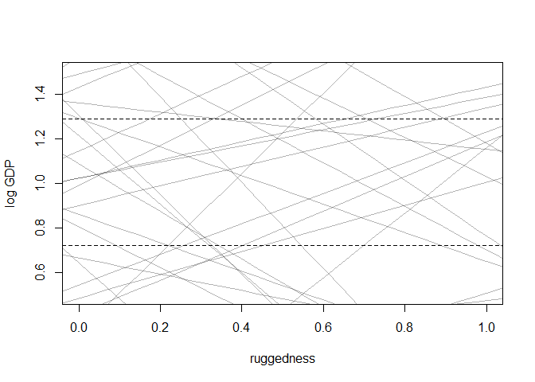
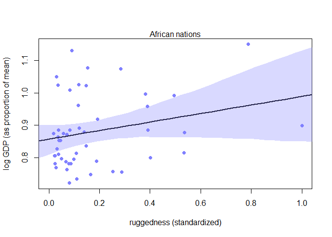
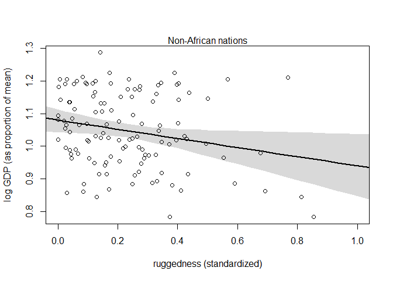
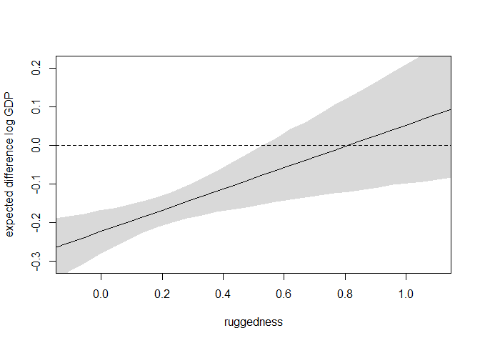
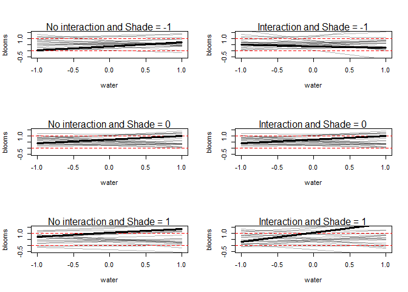
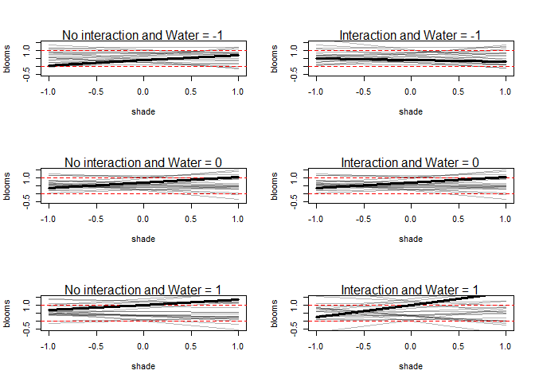

    


```r
library(tidyverse)
```

```
## -- Attaching packages ------------------------------------------------------- tidyverse 1.2.1 --
```

```
## v ggplot2 3.1.1     v purrr   0.3.2
## v tibble  2.1.3     v dplyr   0.8.1
## v tidyr   0.8.3     v stringr 1.4.0
## v readr   1.3.1     v forcats 0.4.0
```

```
## -- Conflicts ---------------------------------------------------------- tidyverse_conflicts() --
## x dplyr::filter() masks stats::filter()
## x dplyr::lag()    masks stats::lag()
```

```r
library(rethinking)
```

```
## Loading required package: rstan
```

```
## Loading required package: StanHeaders
```

```
## rstan (Version 2.18.2, GitRev: 2e1f913d3ca3)
```

```
## For execution on a local, multicore CPU with excess RAM we recommend calling
## options(mc.cores = parallel::detectCores()).
## To avoid recompilation of unchanged Stan programs, we recommend calling
## rstan_options(auto_write = TRUE)
```

```
## For improved execution time, we recommend calling
## Sys.setenv(LOCAL_CPPFLAGS = '-march=native')
## although this causes Stan to throw an error on a few processors.
```

```
## 
## Attaching package: 'rstan'
```

```
## The following object is masked from 'package:tidyr':
## 
##     extract
```

```
## Loading required package: parallel
```

```
## rethinking (Version 1.88)
```

```
## 
## Attaching package: 'rethinking'
```

```
## The following object is masked from 'package:purrr':
## 
##     map
```

# 8 Conditional Manatees
## 8.1. Building an interaction
### 8.1.1. Making two models

```r
data(rugged)
d <- rugged
# make log version of outcome
d$log_gdp <- log( d$rgdppc_2000 )
# extract countries with GDP data
dd <- d[ complete.cases(d$rgdppc_2000) , ]
# rescale variables
dd$log_gdp_std <- dd$log_gdp / mean(dd$log_gdp)
dd$rugged_std <- dd$rugged / max(dd$rugged)
# split countries into Africa and not-Africa
d.A1 <- dd[ dd$cont_africa==1 , ] # Africa
d.A0 <- dd[ dd$cont_africa==0 , ] # not Africa
```


```r
m8.1 <- quap(
  alist(
    log_gdp_std ~ dnorm( mu , sigma ) ,
    mu <- a + b*( rugged_std - 0.215 ) ,
    a ~ dnorm( 1 , 1 ) ,
    b ~ dnorm( 0 , 1 ) ,
    sigma ~ dexp( 1 )
  ),
  data=d.A1 )
```


```r
set.seed(7)
prior <- extract.prior( m8.1 )
# set up the plot dimensions
plot( NULL , xlim=c(0,1) , ylim=c(0.5,1.5) ,
      xlab="ruggedness" , ylab="log GDP" )
abline( h=min(dd$log_gdp_std) , lty=2 )
abline( h=max(dd$log_gdp_std) , lty=2 )
# draw 50 lines from the prior
rugged_seq <- seq( from=-0.1 , to=1.1 , length.out=30 )
mu <- link( m8.1 , post=prior , data=data.frame(rugged_std=rugged_seq) )
for ( i in 1:50 ) lines( rugged_seq , mu[i,] , col=col.alpha("black",0.3) )
```

<!-- -->


```r
sum( abs(prior$b) > 0.6 ) / length(prior$b)
```

```
## [1] 0.545
```


```r
m8.1 <- quap(
  alist(
    log_gdp_std ~ dnorm( mu , sigma ) ,
    mu <- a + b*( rugged_std - 0.215 ) ,
    a ~ dnorm( 1 , 0.1 ) ,
    b ~ dnorm( 0 , 0.3 ) ,
    sigma ~ dexp(1)
  ) ,
  data=d.A1 )
```


```r
set.seed(7)
prior <- extract.prior( m8.1 )
# set up the plot dimensions
plot( NULL , xlim=c(0,1) , ylim=c(0.5,1.5) ,
      xlab="ruggedness" , ylab="log GDP" )
abline( h=min(dd$log_gdp_std) , lty=2 )
abline( h=max(dd$log_gdp_std) , lty=2 )
# draw 50 lines from the prior
rugged_seq <- seq( from=-0.1 , to=1.1 , length.out=30 )
mu <- link( m8.1 , post=prior , data=data.frame(rugged_std=rugged_seq) )
for ( i in 1:50 ) lines( rugged_seq , mu[i,] , col=col.alpha("black",0.3) )
```

<!-- -->


```r
sum( abs(prior$b) > 0.6 ) / length(prior$b)
```

```
## [1] 0.05
```


```r
# Non-African nations
m8.2 <- quap(
  alist(
    log_gdp_std ~ dnorm( mu , sigma ) ,
    mu <- a + b*( rugged_std - 0.215 ) ,
    a ~ dnorm( 1 , 0.1 ) ,
    b ~ dnorm( 0 , 0.3 ) ,
    sigma ~ dexp(1)
  ) ,
  data=d.A0 )
```


```r
precis(m8.1)
```

```
##            mean         sd       5.5%     94.5%
## a     0.8863552 0.01502624 0.86234041 0.9103701
## b     0.1329985 0.07121913 0.01917662 0.2468205
## sigma 0.1048078 0.01057309 0.08790992 0.1217056
```

```r
precis(m8.2)
```

```
##             mean          sd        5.5%       94.5%
## a      1.0505477 0.010097584  1.03440983  1.06668561
## b     -0.1423379 0.055615837 -0.23122278 -0.05345309
## sigma  0.1112855 0.007147544  0.09986233  0.12270864
```

### 8.1.2. Adding an indicator variable doesn’t work

```r
m8.3 <- quap(
  alist(
    log_gdp_std ~ dnorm( mu , sigma ) ,
    mu <- a + b*( rugged_std - 0.215 ) ,
    a ~ dnorm( 1 , 0.1 ) ,
    b ~ dnorm( 0 , 0.3 ) ,
    sigma ~ dexp( 1 )
  ) ,
  data=dd )
```


```r
# make variable to index Africa (1) or not (2)
dd$cid <- ifelse( dd$cont_africa==1 , 1 , 2 )
```


```r
m8.4 <- quap(
  alist(
    log_gdp_std ~ dnorm( mu , sigma ) ,
    mu <- a[cid] + b*( rugged_std - 0.215 ) ,
    a[cid] ~ dnorm( 1 , 0.1 ) ,
    b ~ dnorm( 0 , 0.3 ) ,
    sigma ~ dexp( 1 )
  ) ,
  data=dd )
```


```r
compare( m8.3 , m8.4 )
```

```
##           WAIC    pWAIC    dWAIC       weight       SE      dSE
## m8.4 -251.6212 4.560536  0.00000 1.000000e+00 15.38634       NA
## m8.3 -188.7478 2.679587 62.87333 2.224485e-14 13.27702 15.13296
```


```r
precis( m8.4 , depth=2 )
```

```
##              mean          sd       5.5%      94.5%
## a[1]   0.88041523 0.015938361  0.8549426 0.90588781
## a[2]   1.04915979 0.010186434  1.0328799 1.06543968
## b     -0.04650665 0.045690613 -0.1195291 0.02651578
## sigma  0.11239716 0.006092404  0.1026603 0.12213400
```


```r
rugged.seq <- seq( from=-0.1 , to=1.1 , length.out=30 )
# compute mu over samples, fixing cid=2
mu.NotAfrica <- link( m8.4 ,
                      data=data.frame( cid=2 , rugged_std=rugged.seq ) )
# compute mu over samples, fixing cid=1
mu.Africa <- link( m8.4 ,
                   data=data.frame( cid=1 , rugged_std=rugged.seq ) )
# summarize to means and intervals
mu.NotAfrica_mu <- apply( mu.NotAfrica , 2 , mean )
mu.NotAfrica_ci <- apply( mu.NotAfrica , 2 , PI , prob=0.97 )
mu.Africa_mu <- apply( mu.Africa , 2 , mean )
mu.Africa_ci <- apply( mu.Africa , 2 , PI , prob=0.97 )
```
### 8.1.3. Adding an interaction does work

```r
m8.5 <- quap(
  alist(
    log_gdp_std ~ dnorm( mu , sigma ) ,
    mu <- a[cid] + b[cid]*( rugged_std - 0.215 ) ,
    a[cid] ~ dnorm( 1 , 0.1 ) ,
    b[cid] ~ dnorm( 0 , 0.3 ) ,
    sigma ~ dexp( 1 )
  ) ,
  data=dd )
```


```r
precis( m8.5 , depth=2 )
```

```
##             mean          sd       5.5%       94.5%
## a[1]   0.8865654 0.015675225  0.8615134  0.91161746
## a[2]   1.0505690 0.009936302  1.0346888  1.06644911
## b[1]   0.1324980 0.074202291  0.0139084  0.25108759
## b[2]  -0.1425556 0.054747783 -0.2300532 -0.05505812
## sigma  0.1094907 0.005934840  0.1000057  0.11897574
```


```r
compare( m8.3 , m8.4 , m8.5 )
```

```
##           WAIC    pWAIC     dWAIC       weight       SE       dSE
## m8.5 -258.4682 5.493776  0.000000 9.565818e-01 15.30885        NA
## m8.4 -252.2832 4.236216  6.184976 4.341819e-02 15.21393  6.739544
## m8.3 -188.7023 2.723220 69.765897 6.780319e-16 13.29740 15.510165
```


```r
waic_list <- WAIC( m8.5 , pointwise=TRUE )
```

### 8.1.4. Plotting the interaction

```r
# plot Africa - cid=1
plot( d.A1$rugged_std , d.A1$log_gdp_std , pch=16 , col=rangi2 ,
      xlab="ruggedness (standardized)" , ylab="log GDP (as proportion of mean)" ,
      xlim=c(0,1) )
mu <- link( m8.5 , data=data.frame( cid=1 , rugged_std=rugged_seq ) )
mu_mean <- apply( mu , 2 , mean )
mu_ci <- apply( mu , 2 , PI , prob=0.97 )
lines( rugged_seq , mu_mean , lwd=2 )
shade( mu_ci , rugged_seq , col=col.alpha(rangi2,0.3) )
mtext("African nations")
```

<!-- -->


```r
# plot non-Africa - cid=2
plot( d.A0$rugged_std , d.A0$log_gdp_std , pch=1 , col="black" ,
      xlab="ruggedness (standardized)" , ylab="log GDP (as proportion of mean)" ,
      xlim=c(0,1) )
mu <- link( m8.5 , data=data.frame( cid=2 , rugged_std=rugged_seq ) )
mu_mean <- apply( mu , 2 , mean )
mu_ci <- apply( mu , 2 , PI , prob=0.97 )
lines( rugged_seq , mu_mean , lwd=2 )
shade( mu_ci , rugged_seq )
mtext("Non-African nations")
```

<!-- -->

## 8.2. Symmetry of interactions


```r
rugged_seq <- seq(from=-0.2,to=1.2,length.out=30)
muA <- link( m8.5 , data=data.frame(cid=1,rugged_std=rugged_seq) )
muN <- link( m8.5 , data=data.frame(cid=2,rugged_std=rugged_seq) )
delta <- muA - muN
mu_mean <- apply( delta , 2 , mean )
mu_ci <- apply( delta , 2 , PI , prob=0.97 )
plot(rugged_seq,
     mu_mean,
     type="l",
     xlab="ruggedness",
     ylab="expected difference log GDP",
     xlim=c(-.1,1.1),
     ylim=c(-0.31,.21))
shade( mu_ci , rugged_seq )
abline(a=0,b=0, lty=2)
```

<!-- -->

## 8.3. Continuous interactions
### 8.3.1. A winter flower

```r
data(tulips)
d <- tulips
str(d)
```

```
## 'data.frame':	27 obs. of  4 variables:
##  $ bed   : Factor w/ 3 levels "a","b","c": 1 1 1 1 1 1 1 1 1 2 ...
##  $ water : int  1 1 1 2 2 2 3 3 3 1 ...
##  $ shade : int  1 2 3 1 2 3 1 2 3 1 ...
##  $ blooms: num  0 0 111 183.5 59.2 ...
```
### 8.3.2. The models

```r
d$blooms_std <- d$blooms / max(d$blooms)
d$water_cent <- d$water - mean(d$water)
d$shade_cent <- d$shade - mean(d$shade)
```


```r
a <- rnorm( 1e4 , 0.5 , 1 )
sum( a < 0 | a > 1 ) / length( a )
```

```
## [1] 0.6191
```


```r
a <- rnorm( 1e4 , 0.5 , 0.25 )
sum( a < 0 | a > 1 ) / length( a )
```

```
## [1] 0.0439
```


```r
m8.6 <- quap(
  alist(
    blooms_std ~ dnorm( mu , sigma ) ,
    mu <- a + bw*water_cent + bs*shade_cent ,
    a ~ dnorm( 0.5 , 0.25 ) ,
    bw ~ dnorm( 0 , 0.25 ) ,
    bs ~ dnorm( 0 , 0.25 ) ,
    sigma ~ dexp( 1 )
) ,
data=d )
```


```r
m8.7 <- quap(
  alist(
    blooms_std ~ dnorm( mu , sigma ) ,
    mu <- a + bw*water_cent + bs*shade_cent + bws*water_cent*shade_cent ,
    a ~ dnorm( 0.5 , 0.25 ) ,
    bw ~ dnorm( 0 , 0.25 ) ,
    bs ~ dnorm( 0 , 0.25 ) ,
    bws ~ dnorm( 0 , 0.25 ) ,
    sigma ~ dexp( 1 )
  ) ,
  data=d )
```

### 8.3.3. Plotting posterior predictions

```r
par(mfrow=c(3,2)) # 3 plots in 1 row
for ( s in -1:1 ) {
  idx <- which( d$shade_cent==s )
  plot( d$water_cent[idx] , d$blooms_std[idx] , xlim=c(-1,1) , ylim=c(0,1) ,
  xlab="water" , ylab="blooms" , pch=16 , col=rangi2 )
  mu <- link( m8.6 , data=data.frame( shade_cent=s , water_cent=-1:1 ) )
  for ( i in 1:20 ) lines( -1:1 , mu[i,] , col=col.alpha("black",0.3) )
  mtext(paste("No interaction and Shade =", s))
  plot( d$water_cent[idx] , d$blooms_std[idx] , xlim=c(-1,1) , ylim=c(0,1) ,
  xlab="water" , ylab="blooms" , pch=16 , col=rangi2 )
  mu <- link( m8.7 , data=data.frame( shade_cent=s , water_cent=-1:1 ) )
  for ( i in 1:20 ) lines( -1:1 , mu[i,] , col=col.alpha("black",0.3) )
  mtext(paste("Interaction and Shade =", s))
}
```

<!-- -->


```r
par(mfrow=c(3,2)) # 3 plots in 1 row
for ( w in -1:1 ) {
  idx <- which( d$water_cent==w )
  plot( d$shade_cent[idx] , d$blooms_std[idx] , xlim=c(-1,1) , ylim=c(0,1) ,
  xlab="shade" , ylab="blooms" , pch=16 , col=rangi2 )
  mu <- link( m8.6 , data=data.frame( shade_cent=-1:1 , water_cent=w ) )
  for ( i in 1:20 ) lines( -1:1 , mu[i,] , col=col.alpha("black",0.3) )
  mtext(paste("No interaction and Water =", w))
  plot( d$shade_cent[idx] , d$blooms_std[idx] , xlim=c(-1,1) , ylim=c(0,1) ,
  xlab="shade" , ylab="blooms" , pch=16 , col=rangi2 )
  mu <- link( m8.7 , data=data.frame( shade_cent=-1:1 , water_cent=w ) )
  for ( i in 1:20 ) lines( -1:1 , mu[i,] , col=col.alpha("black",0.3) )
  mtext(paste("Interaction and Water =", w))
}
```

<!-- -->
### 8.3.4. Plotting prior predictions.

```r
set.seed(7)
prior1 <- extract.prior(m8.6)
set.seed(7)
prior2 <- extract.prior(m8.7)
```


```r
par(mfrow=c(3,2)) # 3 plots in 1 row
for ( s in -1:1 ) {
  idx <- which( d$shade_cent==s )
  plot(NA, xlim=c(-1,1) , ylim=c(-.5,1.5) ,
  xlab="water" , ylab="blooms" , pch=16 , col=rangi2 )
  mu <- link( m8.6 , post = prior1, data=data.frame( shade_cent=s , water_cent=-1:1 ) )
  for ( i in 1:20 ) lines( -1:1 , mu[i,] , col=col.alpha("black",0.3) )
  mtext(paste("No interaction and Shade =", s))
  abline(h = 1, lty = 2, col = 'red')
  abline(h = 0, lty = 2, col = 'red')
  lines( -1:1 , mu[21,] , col=col.alpha("black",1), lwd=3 ) 
  plot(NA, xlim=c(-1,1) , ylim=c(-0.5,1.5) ,
  xlab="water" , ylab="blooms" , pch=16 , col=rangi2 )
  mu <- link( m8.7, post = prior2, data=data.frame( shade_cent=s , water_cent=-1:1 ) )
  for ( i in 1:20 ) lines( -1:1 , mu[i,] , col=col.alpha("black",0.3) )
  mtext(paste("Interaction and Shade =", s))
  abline(h = 1, lty = 2, col = 'red')
  abline(h = 0, lty = 2, col = 'red')
  lines( -1:1 , mu[21,] , col=col.alpha("black",1), lwd=3 )
}
```

<!-- -->


```r
par(mfrow=c(3,2)) # 3 plots in 1 row
for ( w in -1:1 ) {
  idx <- which( d$water_cent==w )
  plot(NA, xlim=c(-1,1) , ylim=c(-.5,1.5) ,
  xlab="shade" , ylab="blooms" , pch=16 , col=rangi2 )
  mu <- link( m8.6 , post = prior1, data=data.frame( shade_cent=-1:1 , water_cent=w ) )
  for ( i in 1:20 ) lines( -1:1 , mu[i,] , col=col.alpha("black",0.3) )
  mtext(paste("No interaction and Water =", w))
  abline(h = 1, lty = 2, col = 'red')
  abline(h = 0, lty = 2, col = 'red')
  lines( -1:1 , mu[21,] , col=col.alpha("black",1), lwd=3 ) 
  plot(NA, xlim=c(-1,1) , ylim=c(-0.5,1.5) ,
  xlab="shade" , ylab="blooms" , pch=16 , col=rangi2 )
  mu <- link( m8.7, post = prior2, data=data.frame( water_cent=w , shade_cent=-1:1 ) )
  for ( i in 1:20 ) lines( -1:1 , mu[i,] , col=col.alpha("black",0.3) )
  mtext(paste("Interaction and Water =", w))
  abline(h = 1, lty = 2, col = 'red')
  abline(h = 0, lty = 2, col = 'red')
  lines( -1:1 , mu[21,] , col=col.alpha("black",1), lwd=3 )
}
```

<!-- -->
