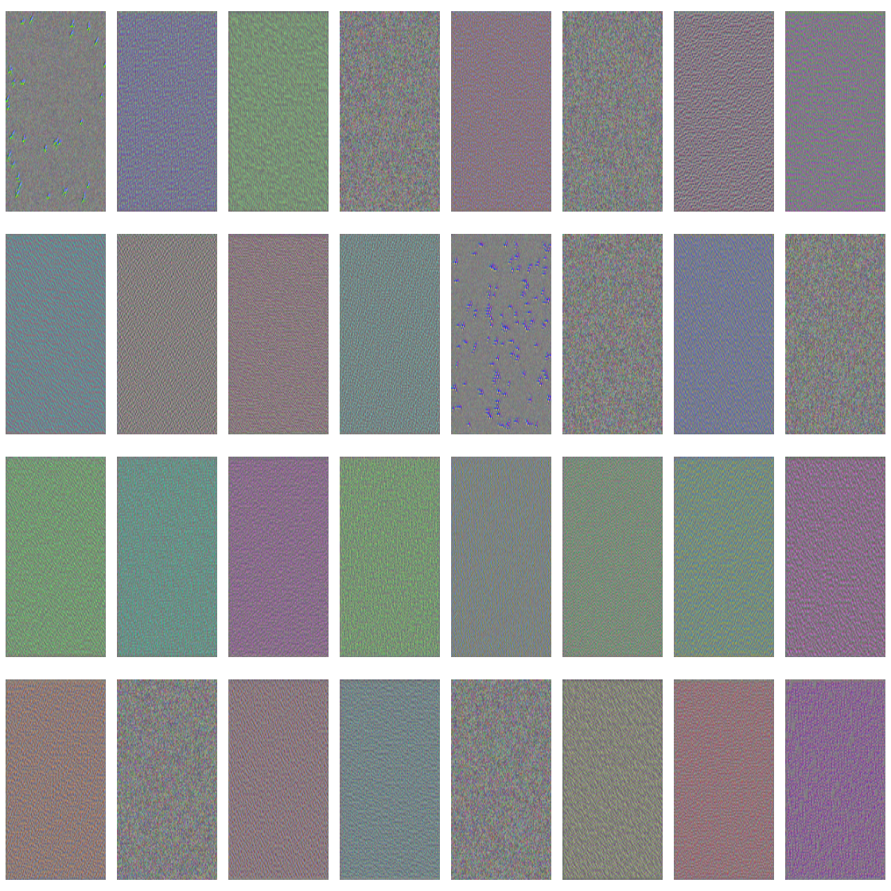

```{r setup, include=FALSE}
knitr::opts_chunk$set(echo = TRUE)
```

```{r}
library("keras")
library("dplyr")
library("tensorflow")
library("grid")
library("gridExtra")
library("magick")
library("viridis")
tf$compat$v1$disable_eager_execution()
```

### 1. Repeat the activation visualization (5.4.1) but for a dog image.  Compare to the cat activations.  Any interesting differences, especially in the last layer?

```{r, data_load}
original_dataset_dir <- "Data/cats_and_dogs"
base_dir <- "Data/cats_and_dogs_small"
# dir.create(base_dir)
train_dir <- file.path(base_dir, "train")
# dir.create(train_dir)
validation_dir <- file.path(base_dir, "validation")
# dir.create(validation_dir)
test_dir <- file.path(base_dir, "test")
# dir.create(test_dir)
train_cats_dir <- file.path(train_dir, "cats")
# dir.create(train_cats_dir)
train_dogs_dir <- file.path(train_dir, "dogs")
# dir.create(train_dogs_dir)
validation_cats_dir <- file.path(validation_dir, "cats")
# dir.create(validation_cats_dir)
validation_dogs_dir <- file.path(validation_dir, "dogs")
# dir.create(validation_dogs_dir)
test_cats_dir <- file.path(test_dir, "cats")
# dir.create(test_cats_dir)
test_dogs_dir <- file.path(test_dir, "dogs")
```

```{r, model_build}
model <- keras_model_sequential() %>%
  layer_conv_2d(filters = 32, kernel_size = c(3, 3), activation = "relu",
                input_shape = c(150, 150, 3)) %>%
  layer_max_pooling_2d(pool_size = c(2, 2)) %>%
  layer_conv_2d(filters = 64, kernel_size = c(3, 3), activation = "relu") %>%
  layer_max_pooling_2d(pool_size = c(2, 2)) %>%
  layer_conv_2d(filters = 128, kernel_size = c(3, 3), activation = "relu") %>%
  layer_max_pooling_2d(pool_size = c(2, 2)) %>%
  layer_conv_2d(filters = 128, kernel_size = c(3, 3), activation = "relu") %>%
  layer_max_pooling_2d(pool_size = c(2, 2)) %>%
  layer_flatten() %>%
  layer_dropout(rate = 0.5) %>%
  layer_dense(units = 512, activation = "relu") %>%
  layer_dense(units = 1, activation = "sigmoid")
model %>% compile(
  loss = "binary_crossentropy",
  optimizer = optimizer_rmsprop(lr = 1e-4),
  metrics = c("acc")
)
```

```{r, build_generators}
datagen <- image_data_generator(
  rescale = 1/255,
  rotation_range = 40,
  width_shift_range = 0.2,
  height_shift_range = 0.2,
  shear_range = 0.2,
  zoom_range = 0.2,
  horizontal_flip = TRUE
)
test_datagen <- image_data_generator(rescale = 1/255)
train_generator <- flow_images_from_directory(          
  train_dir,                                            
  datagen,                                              
  target_size = c(150, 150),                            
  batch_size = 20,
  class_mode = "binary"                                 
)
validation_generator <- flow_images_from_directory(
  validation_dir,
  test_datagen,
  target_size = c(150, 150),
  batch_size = 20,
  class_mode = "binary"
)
history <- model %>% fit_generator(
  train_generator,
  steps_per_epoch = 100,
  epochs = 100,
  validation_data = validation_generator,
  validation_steps = 50
)
```

```{r, model_look}
model
```

```{r, model_save}
# model_bak <- model
# model %>% save_model_hdf5("cats_and_dogs_small_2.h5")
```

# OG Cat
```{r, visualize_cat}
cat_img_path <- "Data/cats_and_dogs_small/test/cats/cat.1700.jpg"
cat_img <- image_load(cat_img_path, target_size = c(150, 150))                 
cat_img_tensor <- image_to_array(cat_img)
cat_img_tensor <- array_reshape(cat_img_tensor, c(1, 150, 150, 3))
cat_img_tensor <- cat_img_tensor / 255                                         
dim(cat_img_tensor)
```

```{r, plot_cat}
plot(as.raster(cat_img_tensor[1,,,]))
```

# New Dog
```{r, visualize_dog}
dog_img_path <- "Data/cats_and_dogs_small/test/dogs/dog.1700.jpg"
dog_img <- image_load(dog_img_path, target_size = c(150, 150))                 
dog_img_tensor <- image_to_array(dog_img)
dog_img_tensor <- array_reshape(dog_img_tensor, c(1, 150, 150, 3))
dog_img_tensor <- dog_img_tensor / 255                                         
dim(dog_img_tensor)
```

```{r, plot_dog}
plot(as.raster(dog_img_tensor[1,,,]))
```

```{r, make_activation}
layer_outputs <- lapply(model$layers[1:8], function(layer) layer$output)      
activation_model <- keras_model(inputs = model$input, outputs = layer_outputs)
```

```{r, cat_activation}
cat_activations <- activation_model %>% predict(cat_img_tensor)
```

```{r, dog_activation}
dog_activations <- activation_model %>% predict(dog_img_tensor)
```

```{r, first_layer}
cat_first_layer_activation <- cat_activations[[1]]
dog_first_layer_activation <- dog_activations[[1]]
```

```{r, plot_function}
plot_channel <- function(channel) {
  rotate <- function(x) t(apply(x, 2, rev))
  image(rotate(channel), axes = FALSE, asp = 1,
        col = terrain.colors(12))
}
```

```{r, plot_channel_1}
plot_channel(cat_first_layer_activation[1,,,2])
plot_channel(dog_first_layer_activation[1,,,2])
```

```{r, plot_all_cat}
image_size <- 58
images_per_row <- 16

for (i in 1:8) {

  layer_activation <- cat_activations[[i]]
  layer_name <- model$layers[[i]]$name

  n_features <- dim(layer_activation)[[4]]
  n_cols <- n_features %/% images_per_row

  png(paste0("cat_activations_", i, "_", layer_name, ".png"),
      width = image_size * images_per_row,
      height = image_size * n_cols)
  op <- par(mfrow = c(n_cols, images_per_row), mai = rep_len(0.02, 4))

  for (col in 0:(n_cols-1)) {
    for (row in 0:(images_per_row-1)) {
      channel_image <- layer_activation[1,,,(col*images_per_row) + row + 1]
      plot_channel(channel_image)
    }
  }

  par(op)
  dev.off()
}
```

```{r, plot_all_dog}
image_size <- 58
images_per_row <- 16

for (i in 1:8) {

  layer_activation <- dog_activations[[i]]
  layer_name <- model$layers[[i]]$name

  n_features <- dim(layer_activation)[[4]]
  n_cols <- n_features %/% images_per_row

  png(paste0("dog_activations_", i, "_", layer_name, ".png"),
      width = image_size * images_per_row,
      height = image_size * n_cols)
  op <- par(mfrow = c(n_cols, images_per_row), mai = rep_len(0.02, 4))

  for (col in 0:(n_cols-1)) {
    for (row in 0:(images_per_row-1)) {
      channel_image <- layer_activation[1,,,(col*images_per_row) + row + 1]
      plot_channel(channel_image)
    }
  }

  par(op)
  dev.off()
}
```


By the last layer they look pretty similar and would be hard to tell apart

### 2. Visualize the filters (using the methods from 5.4.2) for the cat/dog model

```{r}
deprocess_image <- function(x) {
  dms <- dim(x)
  x <- x - mean(x)                        
  x <- x / (sd(x) + 1e-5)                 
  x <- x * 0.1                            
  x <- x + 0.5                            
  x <- pmax(0, pmin(x, 1))                
  array(x, dim = dms)                     
}
```


```{r}
generate_pattern <- function(layer_name, filter_index, size = 150) {
  layer_output <- model$get_layer(layer_name)$output                      
  loss <- k_mean(layer_output[,,,filter_index])                           
  grads <- k_gradients(loss, model$input)[[1]]                            
  grads <- grads / (k_sqrt(k_mean(k_square(grads))) + 1e-5)               
  iterate <- k_function(list(model$input), list(loss, grads))             
  input_img_data <-                                                       
    array(runif(size * size * 3), dim = c(1, size, size, 3)) * 20 + 128   
  step <- 1                                                               
  for (i in 1:40) {                                                       
    c(loss_value, grads_value) %<-% iterate(list(input_img_data))         
    input_img_data <- input_img_data + (grads_value * step)               
  }                                                                       
  img <- input_img_data[1,,,]
  deprocess_image(img)
}
```

```{r}
dir.create("cat_and_dog_vgg_filters")
layer_list <- c()
for(i in 1:8){
  layer_list <- c(layer_list, get_layer(model, index = i)$name)
}
for (layer_name in layer_list) {
  size <- 140
  png(paste0("cat_and_dog_vgg_filters/", layer_name, ".png"),
      width = 8 * size, height = 8 * size)

  grobs <- list()
  for (i in 0:7) {
    for (j in 0:3) {
      pattern <- generate_pattern(layer_name, i + (j*8) + 1, size = size)
      grob <- rasterGrob(pattern,
                         width = unit(0.9, "npc"),
                         height = unit(0.9, "npc"))
      grobs[[length(grobs)+1]] <- grob
    }
  }

  grid.arrange(grobs = grobs, ncol = 8)
  dev.off()
}
```





### 3.  Run the attached image through the cat/dog categorization.  Does it categorize correctly?  Make a heatmap showing which areas of the image contributed (5.4.3)

```{r}
model2 <- application_vgg16(weights = "imagenet")
```

```{r}
img_path <- "Data/_MG_2350.jpg"              
img <- image_load(img_path, target_size = c(224, 224)) %>%           
  image_to_array() %>%                                               
  array_reshape(dim = c(1, 224, 224, 3)) %>%                         
  imagenet_preprocess_input()    
```


```{r}
preds <- model2 %>% predict(img)
imagenet_decode_predictions(preds, top = 3)[[1]]
```

```{r}
which.max(preds[1,])
```

```{r}
dog_output <- model2$output[, 210]                             
last_conv_layer <- model2 %>% get_layer("block5_conv3")                     
grads <- k_gradients(dog_output, last_conv_layer$output)[[1]] 
pooled_grads <- k_mean(grads, axis = c(1, 2, 3))                           
iterate <- k_function(list(model2$input),                                   
                      list(pooled_grads, last_conv_layer$output[1,,,]))
c(pooled_grads_value, conv_layer_output_value) %<-% iterate(list(img))     
for (i in 1:512) {                                                         
  conv_layer_output_value[,,i] <-
    conv_layer_output_value[,,i] * pooled_grads_value[[i]]
}
heatmap <- apply(conv_layer_output_value, c(1,2), mean)                    
```

```{r}
heatmap <- pmax(heatmap, 0)
heatmap <- heatmap / max(heatmap)                                          
write_heatmap <- function(heatmap, filename, width = 224, height = 224,    
                          bg = "white", col = terrain.colors(12)) {
  png(filename, width = width, height = height, bg = bg)
  op = par(mar = c(0,0,0,0))
  on.exit({par(op); dev.off()}, add = TRUE)
  rotate <- function(x) t(apply(x, 2, rev))
  image(rotate(heatmap), axes = FALSE, asp = 1, col = col)
}
write_heatmap(heatmap, "dog_heatmap.png")    
```

```{r}
image <- image_read(img_path)                                      
info <- image_info(image)
geometry <- sprintf("%dx%d!", info$width, info$height)
pal <- col2rgb(viridis(20), alpha = TRUE)                          
alpha <- floor(seq(0, 255, length = ncol(pal)))
pal_col <- rgb(t(pal), alpha = alpha, maxColorValue = 255)
write_heatmap(heatmap, "dog_overlay.png",
              width = 14, height = 14, bg = NA, col = pal_col)
image_read("dog_overlay.png") %>%                             
  image_resize(geometry, filter = "quadratic") %>%
  image_composite(image, operator = "blend", compose_args = "20") %>%
  plot()
```

