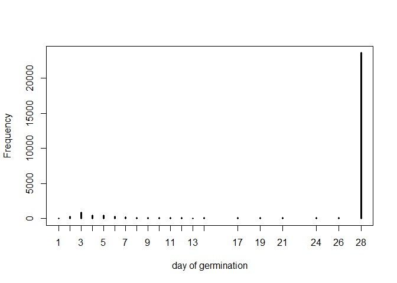
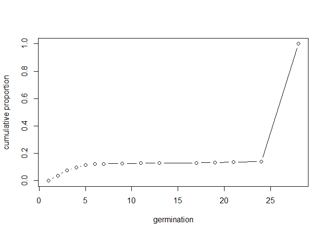

Germination Modeling
================
John D.
10\_7\_2020

``` r
library(rethinking)
library(tidyverse)
```

``` r
dat <- read_csv("light_round1_tall.csv")
```

    ## Parsed with column specification:
    ## cols(
    ##   pops = col_character(),
    ##   temps = col_double(),
    ##   wps = col_double(),
    ##   date = col_character(),
    ##   total_seeds = col_double(),
    ##   germ = col_double(),
    ##   start_date = col_date(format = ""),
    ##   census_date = col_date(format = ""),
    ##   day = col_double(),
    ##   cumulative_germ = col_double(),
    ##   cumulative_prop_germ = col_double()
    ## )

``` r
head(dat)
```

    ## # A tibble: 6 x 11
    ##   pops  temps   wps date  total_seeds  germ start_date census_date   day
    ##   <chr> <dbl> <dbl> <chr>       <dbl> <dbl> <date>     <date>      <dbl>
    ## 1 CAAM      5  -0.6 June~          50     0 2020-06-05 2020-06-06      1
    ## 2 CAAM      5  -0.6 June~          50     0 2020-06-05 2020-06-07      2
    ## 3 CAAM      5  -0.6 June~          50     0 2020-06-05 2020-06-08      3
    ## 4 CAAM      5  -0.6 June~          50     0 2020-06-05 2020-06-09      4
    ## 5 CAAM      5  -0.6 June~          50     0 2020-06-05 2020-06-10      5
    ## 6 CAAM      5  -0.6 June~          50     0 2020-06-05 2020-06-11      6
    ## # ... with 2 more variables: cumulative_germ <dbl>, cumulative_prop_germ <dbl>

# Filter down data

``` r
## Explode data set, 1 row per seed

dat.explode <- data.frame("population" = NA,
                          "temperature" = NA,
                          "water_potential" = NA,
                          "germ" = NA,
                          "days_to_event" = NA)
dat.explode <- dat.explode[-1,]
### Germinated seeds
dat.small <- dat %>%
  filter(germ != 0) %>%
  select("population" = pops, "temperature" = temps, 
         "water_potential" = wps, germ, "days_to_event" = day)

for(i in 1:nrow(dat.small)){
  dat.explode <- rbind(dat.explode,
                       dat.small %>% slice(rep(i:i, each = dat.small[[i,4]]))
  )
}

dat.explode$germ <- 1

### Ungerminated seeds
duds_per_trt <- dat %>%
  group_by(pops, temps, wps) %>%
  slice(n()) %>%
  ungroup() %>%
  mutate(duds = total_seeds -cumulative_germ,
         duds = ifelse(duds <0, 0, duds),
         germ = 0) %>%
  select("population" = pops, "temperature" = temps, 
         "water_potential" = wps, germ,
         "days_to_event" = day, duds)

for(i in 1:nrow(duds_per_trt)){
  dat.explode <- rbind(dat.explode,
                       duds_per_trt[,-6] %>% slice(rep(i:i, each = duds_per_trt[[i,6]]))
  )
}

dim(dat.explode)
```

    ## [1] 27405     5

``` r
head(dat.explode)
```

    ## # A tibble: 6 x 5
    ##   population temperature water_potential  germ days_to_event
    ##   <chr>            <dbl>           <dbl> <dbl>         <dbl>
    ## 1 CAAM                10             0       1             6
    ## 2 CAAM                10             0       1             6
    ## 3 CAAM                10             0       1             6
    ## 4 CAAM                10             0       1             6
    ## 5 CAAM                10             0       1             6
    ## 6 CAAM                25            -0.6     1             2

``` r
## Make data list
dat_list <- list(
  Germ = as.integer(dat.explode$germ),
  Day = dat.explode$days_to_event,
  Water = dat.explode$water_potential,
  Temp = dat.explode$temperature,
  Pop = as.integer(as.factor(dat.explode$population))
)
```

``` r
## Modeling
### Basic, will start using the cat example
model_1 <- ulam(
  alist(
    Day | Germ == 1 ~ exponential(lambda),
    Day | Germ == 0 ~ custom(exponential_lccdf(!Y | lambda)),
    lambda <- 1.0 / mu,
    log(mu) <- alpha_pop[Pop],
    alpha_pop[Pop] ~ normal(0, 1)
  ),
  data = dat_list ,
  chains = 4 ,
  cores = 4
)

precis(model_1, depth = 2)
```

    ##                   mean         sd     5.5%    94.5%    n_eff     Rhat4
    ## alpha_pop[1]  7.160657 0.19302254 6.853560 7.471102 3555.246 0.9984625
    ## alpha_pop[2]  5.710014 0.09816022 5.556080 5.865147 3220.056 0.9998356
    ## alpha_pop[3]  6.194384 0.12917283 5.993268 6.406054 3532.553 0.9990970
    ## alpha_pop[4]  6.047513 0.11485667 5.867573 6.232475 4324.254 0.9995456
    ## alpha_pop[5]  6.436161 0.14554574 6.213821 6.677157 3087.708 0.9996429
    ## alpha_pop[6]  4.379494 0.06021348 4.284626 4.476348 4660.345 0.9994488
    ## alpha_pop[7]  6.583777 0.14975366 6.357844 6.822487 3743.467 0.9988423
    ## alpha_pop[8]  5.825366 0.10407771 5.661793 6.001690 4337.456 0.9986279
    ## alpha_pop[9]  6.172863 0.11466491 5.995442 6.358840 3741.624 0.9988663
    ## alpha_pop[10] 5.779830 0.10223095 5.623053 5.945403 4342.428 0.9984872
    ## alpha_pop[11] 5.654131 0.08901592 5.516537 5.794643 3762.525 0.9985011
    ## alpha_pop[12] 5.585714 0.09660419 5.430492 5.747627 3516.648 0.9981600
    ## alpha_pop[13] 5.145979 0.07405086 5.029902 5.264431 3608.426 0.9986768
    ## alpha_pop[14] 6.417274 0.13057019 6.214772 6.629047 4723.560 0.9983410
    ## alpha_pop[15] 5.694818 0.09782152 5.540386 5.852853 3212.660 1.0005278
    ## alpha_pop[16] 4.664398 0.06249506 4.566603 4.763019 3708.484 1.0007436
    ## alpha_pop[17] 4.949933 0.06856546 4.840708 5.061075 4900.839 0.9992497
    ## alpha_pop[18] 4.686153 0.06273115 4.587747 4.788270 3624.369 0.9983184
    ## alpha_pop[19] 5.027795 0.07329201 4.910466 5.147156 5299.831 0.9990656
    ## alpha_pop[20] 4.632924 0.07181763 4.517815 4.746872 3389.730 0.9993425
    ## alpha_pop[21] 4.383265 0.06934609 4.272428 4.492841 3421.957 0.9999490
    ## alpha_pop[22] 3.942266 0.04626714 3.868875 4.018317 3796.033 0.9989340
    ## alpha_pop[23] 4.185124 0.05125014 4.106533 4.265581 4075.948 0.9987026
    ## alpha_pop[24] 4.344431 0.05400773 4.258715 4.432430 3851.807 0.9983603

``` r
post <- extract.samples(model_1)
post$D <- exp(post$alpha_pop)
precis( post , 2 )
```

    ##                      mean           sd       5.5%       94.5%
    ## alpha_pop[1]     7.160657   0.19302254   6.853560    7.471102
    ## alpha_pop[2]     5.710014   0.09816022   5.556080    5.865147
    ## alpha_pop[3]     6.194384   0.12917283   5.993268    6.406054
    ## alpha_pop[4]     6.047513   0.11485667   5.867573    6.232475
    ## alpha_pop[5]     6.436161   0.14554574   6.213821    6.677157
    ## alpha_pop[6]     4.379494   0.06021348   4.284626    4.476348
    ## alpha_pop[7]     6.583777   0.14975366   6.357844    6.822487
    ## alpha_pop[8]     5.825366   0.10407771   5.661793    6.001690
    ## alpha_pop[9]     6.172863   0.11466491   5.995442    6.358840
    ## alpha_pop[10]    5.779830   0.10223095   5.623053    5.945403
    ## alpha_pop[11]    5.654131   0.08901592   5.516537    5.794643
    ## alpha_pop[12]    5.585714   0.09660419   5.430492    5.747627
    ## alpha_pop[13]    5.145979   0.07405086   5.029902    5.264431
    ## alpha_pop[14]    6.417274   0.13057019   6.214772    6.629047
    ## alpha_pop[15]    5.694818   0.09782152   5.540386    5.852853
    ## alpha_pop[16]    4.664398   0.06249506   4.566603    4.763019
    ## alpha_pop[17]    4.949933   0.06856546   4.840708    5.061075
    ## alpha_pop[18]    4.686153   0.06273115   4.587747    4.788270
    ## alpha_pop[19]    5.027795   0.07329201   4.910466    5.147156
    ## alpha_pop[20]    4.632924   0.07181763   4.517815    4.746872
    ## alpha_pop[21]    4.383265   0.06934609   4.272428    4.492841
    ## alpha_pop[22]    3.942266   0.04626714   3.868875    4.018317
    ## alpha_pop[23]    4.185124   0.05125014   4.106533    4.265581
    ## alpha_pop[24]    4.344431   0.05400773   4.258715    4.432430
    ## D[1]          1312.197707 259.50873881 947.247050 1756.540721
    ## D[2]           303.332703  29.85696755 258.806455  352.534104
    ## D[3]           494.123028  64.80147371 400.722151  605.499903
    ## D[4]           425.865504  49.24366545 353.390111  509.013968
    ## D[5]           630.681793  93.00190124 499.606409  794.058558
    ## D[6]            79.942416   4.82172969  72.575414   87.912992
    ## D[7]           731.525297 112.50877950 577.000948  918.266315
    ## D[8]           340.629821  35.70056659 287.663986  404.111087
    ## D[9]           482.736935  56.03028852 401.594175  577.575794
    ## D[10]          325.406344  33.56372427 276.732867  381.993160
    ## D[11]          286.606692  25.76584261 248.771998  328.534749
    ## D[12]          267.841702  26.09095828 228.261489  313.446115
    ## D[13]          172.211770  12.80731031 152.918100  193.336230
    ## D[14]          617.600716  81.65831882 500.081844  756.761103
    ## D[15]          298.750755  29.38658613 254.776328  348.226361
    ## D[16]          106.309273   6.66575846  96.216751  117.098898
    ## D[17]          141.497866   9.72436722 126.558969  157.760019
    ## D[18]          108.649110   6.84327028  98.272781  120.093455
    ## D[19]          153.006855  11.25104647 135.702663  171.941815
    ## D[20]          103.080158   7.43725486  91.635116  115.223325
    ## D[21]           80.291912   5.57626294  71.695476   89.375005
    ## D[22]           51.590427   2.39079947  47.888473   55.607456
    ## D[23]           65.787982   3.37617206  60.735753   71.206264
    ## D[24]           77.160697   4.17761682  70.719037   84.135648
    ##                                                                                                                              histogram
    ## alpha_pop[1]          <U+2581><U+2581><U+2581><U+2582><U+2583><U+2585><U+2587><U+2585><U+2583><U+2582><U+2581><U+2581><U+2581><U+2581>
    ## alpha_pop[2]  <U+2581><U+2581><U+2581><U+2581><U+2582><U+2585><U+2587><U+2587><U+2585><U+2583><U+2582><U+2581><U+2581><U+2581><U+2581>
    ## alpha_pop[3]                                          <U+2581><U+2581><U+2581><U+2585><U+2587><U+2587><U+2583><U+2581><U+2581><U+2581>
    ## alpha_pop[4]                                                          <U+2581><U+2581><U+2582><U+2585><U+2587><U+2585><U+2582><U+2581>
    ## alpha_pop[5]                                  <U+2581><U+2581><U+2581><U+2583><U+2587><U+2587><U+2585><U+2582><U+2581><U+2581><U+2581>
    ## alpha_pop[6]                                                  <U+2581><U+2581><U+2582><U+2585><U+2587><U+2585><U+2582><U+2581><U+2581>
    ## alpha_pop[7]                          <U+2581><U+2581><U+2581><U+2582><U+2585><U+2587><U+2587><U+2583><U+2581><U+2581><U+2581><U+2581>
    ## alpha_pop[8]          <U+2581><U+2581><U+2581><U+2582><U+2585><U+2587><U+2587><U+2587><U+2585><U+2582><U+2582><U+2581><U+2581><U+2581>
    ## alpha_pop[9]                                                          <U+2581><U+2581><U+2585><U+2587><U+2587><U+2582><U+2581><U+2581>
    ## alpha_pop[10]         <U+2581><U+2581><U+2581><U+2582><U+2585><U+2587><U+2587><U+2587><U+2585><U+2582><U+2581><U+2581><U+2581><U+2581>
    ## alpha_pop[11] <U+2581><U+2581><U+2581><U+2581><U+2582><U+2585><U+2587><U+2587><U+2585><U+2582><U+2581><U+2581><U+2581><U+2581><U+2581>
    ## alpha_pop[12]                 <U+2581><U+2581><U+2582><U+2583><U+2587><U+2587><U+2587><U+2583><U+2582><U+2581><U+2581><U+2581><U+2581>
    ## alpha_pop[13]                         <U+2581><U+2581><U+2582><U+2585><U+2587><U+2587><U+2585><U+2582><U+2581><U+2581><U+2581><U+2581>
    ## alpha_pop[14]                                                 <U+2581><U+2581><U+2583><U+2587><U+2587><U+2585><U+2581><U+2581><U+2581>
    ## alpha_pop[15]         <U+2581><U+2581><U+2581><U+2582><U+2583><U+2587><U+2587><U+2587><U+2585><U+2583><U+2581><U+2581><U+2581><U+2581>
    ## alpha_pop[16]                                                 <U+2581><U+2581><U+2582><U+2587><U+2587><U+2585><U+2582><U+2581><U+2581>
    ## alpha_pop[17]                                         <U+2581><U+2581><U+2582><U+2585><U+2587><U+2587><U+2585><U+2582><U+2581><U+2581>
    ## alpha_pop[18]                                                 <U+2581><U+2581><U+2582><U+2585><U+2587><U+2585><U+2582><U+2581><U+2581>
    ## alpha_pop[19]                                 <U+2581><U+2581><U+2581><U+2582><U+2585><U+2587><U+2585><U+2582><U+2581><U+2581><U+2581>
    ## alpha_pop[20]                                 <U+2581><U+2581><U+2581><U+2582><U+2585><U+2587><U+2587><U+2583><U+2581><U+2581><U+2581>
    ## alpha_pop[21]                                         <U+2581><U+2581><U+2582><U+2587><U+2587><U+2587><U+2583><U+2581><U+2581><U+2581>
    ## alpha_pop[22]                                                                 <U+2581><U+2581><U+2583><U+2587><U+2587><U+2582><U+2581>
    ## alpha_pop[23]                                                         <U+2581><U+2581><U+2583><U+2587><U+2587><U+2582><U+2581><U+2581>
    ## alpha_pop[24]                                                 <U+2581><U+2581><U+2581><U+2583><U+2587><U+2587><U+2582><U+2581><U+2581>
    ## D[1]                                                  <U+2581><U+2582><U+2587><U+2587><U+2585><U+2582><U+2581><U+2581><U+2581><U+2581>
    ## D[2]                                  <U+2581><U+2581><U+2582><U+2585><U+2587><U+2587><U+2585><U+2582><U+2581><U+2581><U+2581><U+2581>
    ## D[3]                                                  <U+2581><U+2581><U+2585><U+2587><U+2585><U+2582><U+2581><U+2581><U+2581><U+2581>
    ## D[4]                                                                  <U+2581><U+2581><U+2585><U+2587><U+2583><U+2581><U+2581><U+2581>
    ## D[5]                  <U+2581><U+2581><U+2581><U+2583><U+2587><U+2587><U+2587><U+2583><U+2582><U+2581><U+2581><U+2581><U+2581><U+2581>
    ## D[6]                                                                          <U+2581><U+2582><U+2587><U+2587><U+2582><U+2581><U+2581>
    ## D[7]                                                  <U+2581><U+2582><U+2587><U+2587><U+2583><U+2581><U+2581><U+2581><U+2581><U+2581>
    ## D[8]                          <U+2581><U+2581><U+2583><U+2587><U+2587><U+2587><U+2585><U+2582><U+2581><U+2581><U+2581><U+2581><U+2581>
    ## D[9]                                                          <U+2581><U+2581><U+2585><U+2587><U+2585><U+2582><U+2581><U+2581><U+2581>
    ## D[10]                                 <U+2581><U+2581><U+2582><U+2585><U+2587><U+2587><U+2585><U+2582><U+2581><U+2581><U+2581><U+2581>
    ## D[11]                                 <U+2581><U+2581><U+2583><U+2587><U+2587><U+2585><U+2582><U+2581><U+2581><U+2581><U+2581><U+2581>
    ## D[12]                                                         <U+2581><U+2582><U+2587><U+2587><U+2585><U+2582><U+2581><U+2581><U+2581>
    ## D[13]                                         <U+2581><U+2581><U+2583><U+2587><U+2587><U+2585><U+2582><U+2581><U+2581><U+2581><U+2581>
    ## D[14]                                         <U+2581><U+2581><U+2585><U+2587><U+2587><U+2585><U+2582><U+2581><U+2581><U+2581><U+2581>
    ## D[15]                                         <U+2581><U+2581><U+2582><U+2585><U+2587><U+2587><U+2583><U+2582><U+2581><U+2581><U+2581>
    ## D[16]                                                 <U+2581><U+2581><U+2583><U+2587><U+2587><U+2585><U+2582><U+2581><U+2581><U+2581>
    ## D[17]                 <U+2581><U+2581><U+2581><U+2582><U+2585><U+2587><U+2587><U+2587><U+2583><U+2582><U+2581><U+2581><U+2581><U+2581>
    ## D[18]                                                 <U+2581><U+2581><U+2582><U+2585><U+2587><U+2585><U+2582><U+2581><U+2581><U+2581>
    ## D[19]                                                         <U+2581><U+2581><U+2582><U+2587><U+2587><U+2583><U+2581><U+2581><U+2581>
    ## D[20]                                         <U+2581><U+2581><U+2582><U+2587><U+2587><U+2587><U+2582><U+2581><U+2581><U+2581><U+2581>
    ## D[21]                                                         <U+2581><U+2581><U+2583><U+2587><U+2587><U+2583><U+2581><U+2581><U+2581>
    ## D[22]                                                                 <U+2581><U+2581><U+2585><U+2587><U+2587><U+2582><U+2581><U+2581>
    ## D[23]                         <U+2581><U+2581><U+2581><U+2583><U+2587><U+2587><U+2587><U+2585><U+2582><U+2581><U+2581><U+2581><U+2581>
    ## D[24]                                                                         <U+2581><U+2581><U+2583><U+2587><U+2583><U+2581><U+2581>

This modeling using a Poisson distribution appears to be showing the
average days per a population to germinate. They are extremely high,
most likely due to zero inflation. Time to convert to Zero inflated
Poisson.

``` r
### Converting cat example to zero inflated Poisson
model_2 <- ulam(
  alist(
    Day | Germ == 1 ~  custom( log1m(p) + poisson_lpmf(Germ|lambda) ),
    Day | Germ == 0 ~ custom(log_mix( p , 0 , poisson_lpmf(0|lambda) ) ),
    logit(p) <- ap[Pop],
    log(lambda) <- al[Pop],
    ap[Pop] ~ dnorm(0,1),
    al[Pop] ~ dnorm(1,3)
  ),
  data = dat_list ,
  chains = 4 ,
  cores = 4
)
### This would take ~16 hours to run on full set. will try on just 2 pops
```

``` r
dat2 <- dat.explode %>%
  filter(population == "STDI" | population == "CAAM")

dat_list2 <- list(
  Germ = as.integer(dat2$germ),
  Day = dat2$days_to_event,
  Water = dat2$water_potential,
  Temp = dat2$temperature,
  Pop = as.integer(as.factor(dat2$population))
)

model_2 <- ulam(
  alist(
    Day | Germ == 1 ~  custom( log1m(p) + poisson_lpmf(Germ|lambda) ),
    Day | Germ == 0 ~ custom(log_mix( p , 0 , poisson_lpmf(0|lambda) ) ),
    logit(p) <- ap[Pop],
    log(lambda) <- al[Pop],
    ap[Pop] ~ dnorm(0,1),
    al[Pop] ~ dnorm(1,3)
  ),
  data = dat_list2 ,
  chains = 4 ,
  cores = 4
)

precis(model_2, depth = 2)
```

    ##            mean          sd      5.5%     94.5%    n_eff     Rhat4
    ## ap[1]  1.220314 0.293768844  0.771218  1.684728 2443.478 1.0021544
    ## ap[2] -3.344692 0.503468366 -4.175956 -2.610848 1819.666 0.9993513
    ## al[1] -2.556037 0.016599574 -2.582706 -2.529433 2498.254 0.9998969
    ## al[2] -2.553384 0.005614096 -2.562225 -2.544061 2924.476 0.9987985

``` r
post <- extract.samples(model_2)
mean( inv_logit( post$ap ) ) # probability dead
```

    ## [1] 0.4029756

``` r
mean( exp( post$al ) ) # approximate seeds per a day
```

    ## [1] 0.07772075

Seems like it’s kinda working, not exactly a germination curve though.
Try treating like an ordered categorical outcome where probability of
germinating increases with each day. Need to also fit in zero inflation

``` r
simplehist( dat.explode$days_to_event , xlim=c(1,28) , xlab="day of germination" )
```

<!-- -->

``` r
### Look at STDI
# discrete proportion of each response value
pr_k <- table( dat2 %>% filter(population == "STDI" ) %>% select(days_to_event)) / nrow(dat2 %>% filter(population == "STDI" ))
# cumsum converts to cumulative proportions
cum_pr_k <- cumsum( pr_k )
# plot
plot( c(1,2,3,4,5,6,7,9,11,13,17,19,21,24,28) , cum_pr_k , type="b" , xlab="germination" ,
ylab="cumulative proportion" , ylim=c(0,1) )
```

<!-- -->

``` r
# Can only use seeds that germinated
dat3 <- dat2 %>% filter(germ != 0)
dat_list3 <- list(
  Germ = as.integer(dat3$germ),
  Day = dat3$days_to_event,
  Water = dat3$water_potential,
  Temp = dat3$temperature,
  Pop = as.integer(as.factor(dat3$population))
)

model_3 <- ulam(
  alist(
    Day ~ dordlogit(phi , cutpoints),
    phi <- alpha_pop[Pop] + beta_water[Pop]*Water + beta_temp[Pop]*Temp,
    alpha_pop[Pop] ~ dnorm(0 , 0.5),
    beta_water[Pop] ~ dnorm(0 , 0.5),
    beta_temp[Pop] ~ dnorm(0 , 0.5),
    cutpoints ~ dnorm(0 , 1.5)
  ) ,
  data = dat_list3 ,
  chains = 4 ,
  cores = 4
)
precis(model_3, depth = 2)
```

    ##                        mean         sd         5.5%       94.5%    n_eff
    ## alpha_pop[1]  -0.2108831322 0.44191905 -0.942456177  0.47146590 1547.215
    ## alpha_pop[2]  -0.6793896460 0.40461062 -1.318346943 -0.02041902 1329.498
    ## beta_water[1]  0.5558677498 0.46210366 -0.182788998  1.28903806 2591.727
    ## beta_water[2] -0.5452644833 0.40483259 -1.196721478  0.09396729 1716.849
    ## beta_temp[1]  -0.0007810241 0.02465043 -0.040641576  0.03757456 1562.244
    ## beta_temp[2]  -0.0544540721 0.01976147 -0.086223717 -0.02283321 1337.317
    ## cutpoints[1]  -5.8443684592 0.59405084 -6.843396920 -4.94573560 1202.501
    ## cutpoints[2]  -2.8132920141 0.33868967 -3.380768807 -2.26962842 2249.195
    ## cutpoints[3]  -1.6037846496 0.31272302 -2.094447109 -1.10362233 2342.988
    ## cutpoints[4]  -1.0329099221 0.30549692 -1.533409019 -0.54767387 2401.551
    ## cutpoints[5]  -0.4176255927 0.29275551 -0.875588093  0.04733709 2624.266
    ## cutpoints[6]  -0.0339820470 0.28364386 -0.495283499  0.42453653 2507.554
    ## cutpoints[7]   0.0617755167 0.28446929 -0.408912881  0.52046662 2615.541
    ## cutpoints[8]   0.0956071611 0.28488523 -0.365825728  0.55762768 2605.318
    ## cutpoints[9]   0.2358870305 0.28465078 -0.228232113  0.69783940 2536.395
    ## cutpoints[10]  0.2717843437 0.28434727 -0.189153771  0.73634052 2524.125
    ## cutpoints[11]  0.3847130081 0.28499795 -0.077080243  0.84793003 2518.092
    ## cutpoints[12]  0.4649431251 0.28870700  0.001587979  0.92429169 2653.224
    ## cutpoints[13]  0.5442288852 0.29029825  0.090148717  1.00990031 2822.109
    ## cutpoints[14]  0.5856009820 0.29100043  0.137474778  1.05460860 2854.434
    ## cutpoints[15]  0.6267753975 0.29121539  0.171311622  1.10246533 2916.837
    ## cutpoints[16]  0.6690833959 0.29252572  0.206746392  1.14567917 2984.189
    ## cutpoints[17]  0.8464821624 0.29981913  0.362978077  1.32702539 2940.466
    ## cutpoints[18]  0.8946341627 0.30205811  0.414536020  1.37612166 2779.138
    ## cutpoints[19]  1.2231329731 0.31208987  0.732153436  1.72222927 3002.671
    ## cutpoints[20]  1.2875065495 0.31445292  0.802630824  1.79942195 3075.709
    ## cutpoints[21]  1.6592814380 0.33636006  1.123322781  2.20229196 3013.131
    ## cutpoints[22]  1.7471629376 0.34181969  1.199560344  2.28670639 3282.971
    ## cutpoints[23]  1.8443836902 0.34895262  1.297749754  2.38970517 3141.988
    ## cutpoints[24]  2.9621887182 0.50870302  2.180482247  3.80731474 2601.741
    ## cutpoints[25]  3.3564489696 0.59666057  2.472247584  4.34857501 3053.900
    ##                   Rhat4
    ## alpha_pop[1]  1.0001644
    ## alpha_pop[2]  1.0000005
    ## beta_water[1] 0.9999390
    ## beta_water[2] 1.0011984
    ## beta_temp[1]  1.0005136
    ## beta_temp[2]  0.9996279
    ## cutpoints[1]  1.0025758
    ## cutpoints[2]  1.0001587
    ## cutpoints[3]  1.0006225
    ## cutpoints[4]  1.0014049
    ## cutpoints[5]  1.0008218
    ## cutpoints[6]  1.0004978
    ## cutpoints[7]  1.0000338
    ## cutpoints[8]  1.0000923
    ## cutpoints[9]  1.0000000
    ## cutpoints[10] 0.9999726
    ## cutpoints[11] 0.9997724
    ## cutpoints[12] 0.9995666
    ## cutpoints[13] 0.9996496
    ## cutpoints[14] 0.9994282
    ## cutpoints[15] 0.9993039
    ## cutpoints[16] 0.9994514
    ## cutpoints[17] 0.9993800
    ## cutpoints[18] 0.9997446
    ## cutpoints[19] 0.9991648
    ## cutpoints[20] 0.9991340
    ## cutpoints[21] 0.9988769
    ## cutpoints[22] 0.9989825
    ## cutpoints[23] 0.9989833
    ## cutpoints[24] 0.9990841
    ## cutpoints[25] 0.9997231

``` r
round( inv_logit(coef(model_3)) , 3 )
```

    ##  alpha_pop[1]  alpha_pop[2] beta_water[1] beta_water[2]  beta_temp[1] 
    ##         0.447         0.336         0.635         0.367         0.500 
    ##  beta_temp[2]  cutpoints[1]  cutpoints[2]  cutpoints[3]  cutpoints[4] 
    ##         0.486         0.003         0.057         0.167         0.263 
    ##  cutpoints[5]  cutpoints[6]  cutpoints[7]  cutpoints[8]  cutpoints[9] 
    ##         0.397         0.492         0.515         0.524         0.559 
    ## cutpoints[10] cutpoints[11] cutpoints[12] cutpoints[13] cutpoints[14] 
    ##         0.568         0.595         0.614         0.633         0.642 
    ## cutpoints[15] cutpoints[16] cutpoints[17] cutpoints[18] cutpoints[19] 
    ##         0.652         0.661         0.700         0.710         0.773 
    ## cutpoints[20] cutpoints[21] cutpoints[22] cutpoints[23] cutpoints[24] 
    ##         0.784         0.840         0.852         0.863         0.951 
    ## cutpoints[25] 
    ##         0.966
