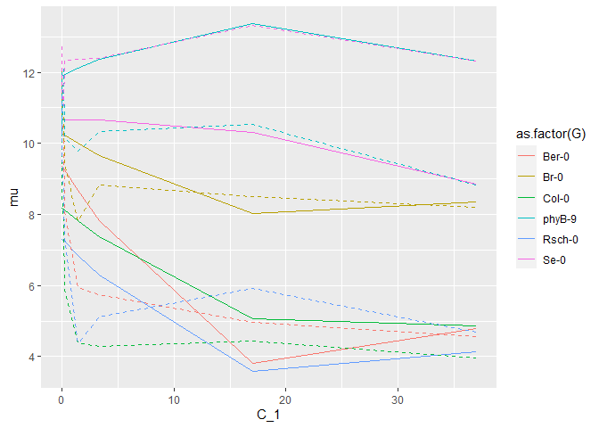

Growth Curve Models
================
John D.
10\_28\_2020

``` r
library(rethinking)
```

    ## Loading required package: rstan

    ## Loading required package: StanHeaders

    ## Loading required package: ggplot2

    ## rstan (Version 2.21.2, GitRev: 2e1f913d3ca3)

    ## For execution on a local, multicore CPU with excess RAM we recommend calling
    ## options(mc.cores = parallel::detectCores()).
    ## To avoid recompilation of unchanged Stan programs, we recommend calling
    ## rstan_options(auto_write = TRUE)

    ## Do not specify '-march=native' in 'LOCAL_CPPFLAGS' or a Makevars file

    ## Loading required package: parallel

    ## rethinking (Version 2.13)

    ## 
    ## Attaching package: 'rethinking'

    ## The following object is masked from 'package:stats':
    ## 
    ##     rstudent

``` r
library(brms)
```

    ## Warning: package 'brms' was built under R version 4.0.3

    ## Loading required package: Rcpp

    ## Loading 'brms' package (version 2.14.0). Useful instructions
    ## can be found by typing help('brms'). A more detailed introduction
    ## to the package is available through vignette('brms_overview').

    ## 
    ## Attaching package: 'brms'

    ## The following objects are masked from 'package:rethinking':
    ## 
    ##     LOO, stancode, WAIC

    ## The following object is masked from 'package:rstan':
    ## 
    ##     loo

    ## The following object is masked from 'package:stats':
    ## 
    ##     ar

``` r
library(tidyverse)
```

    ## -- Attaching packages --------------------------------------- tidyverse 1.3.0 --

    ## v tibble  3.0.4     v dplyr   1.0.2
    ## v tidyr   1.1.2     v stringr 1.4.0
    ## v readr   1.4.0     v forcats 0.5.0
    ## v purrr   0.3.4

    ## Warning: package 'tibble' was built under R version 4.0.3

    ## -- Conflicts ------------------------------------------ tidyverse_conflicts() --
    ## x tidyr::extract() masks rstan::extract()
    ## x dplyr::filter()  masks stats::filter()
    ## x dplyr::lag()     masks stats::lag()
    ## x purrr::map()     masks rethinking::map()

Work on the attached data set from Maloof (2001). It is a series of
growth response curves, either in response to different light or hormone
treatments. The question you want to answer is whether there are
differences in response slopes between the genotypes. Note that the
responses tend to be \~ log-linear with respect to the treatment. I
would recommend picking one of the treatments that approximates (log)
linear such as blue, red, or GA. You may want to truncate the data to
only retain the linear part. But if you want to get fancy don’t truncate
and/or try some of the more challenging treatments (e.g. white).

## Starting with red light

``` r
red <- read_csv("Red.csv")
```

    ## 
    ## -- Column specification --------------------------------------------------------
    ## cols(
    ##   genotype = col_character(),
    ##   concentration = col_double(),
    ##   length = col_double()
    ## )

``` r
head(red)
```

    ## # A tibble: 6 x 3
    ##   genotype concentration length
    ##   <chr>            <dbl>  <dbl>
    ## 1 Ber-0               37   3.96
    ## 2 Br-0                37   7.31
    ## 3 Rsch-0              37   3.95
    ## 4 Se-0                37   9.27
    ## 5 Col-0               37   5.39
    ## 6 phyB-9              37  10.4

``` r
ggplot(data = red, aes(x = length, color = as.factor(concentration))) +
  geom_density() +
  facet_wrap(~genotype)
```

    ## Warning: Removed 971 rows containing non-finite values (stat_density).

<!-- -->

``` r
summary(standardize(log(red$length)))
```

    ##    Min. 1st Qu.  Median    Mean 3rd Qu.    Max.    NA's 
    ## -3.1188 -0.7255  0.2428  0.0000  0.8073  1.7077     971

``` r
red.small <-  red[complete.cases(red$length), ]
dat_list <- list(
  L = standardize(log(red.small$length)),
  G = as.factor(red.small$genotype),
  C = red.small$concentration
)

model_1 <- ulam(
  alist(
    L ~ dnorm(mu, sigma),
    mu <- a[G] + bC[G]*C,
    a[G] ~ dnorm(0, 1),
    bC[G] ~ dnorm(0, 1),
    sigma ~ dexp(1)
  ) ,
  data = dat_list,
  chains = 4 ,
  cores = 4
)
precis(model_1, depth = 2)
```

    ##               mean          sd         5.5%        94.5%    n_eff     Rhat4
    ## a[1]   0.093500801 0.074057298 -0.019176235  0.214841824 1881.180 0.9988528
    ## a[2]   0.477277293 0.054801552  0.391034835  0.565340769 1890.434 0.9993731
    ## a[3]  -0.247907368 0.067431730 -0.358829673 -0.143276748 2025.022 0.9986851
    ## a[4]   0.942855577 0.060344499  0.848530162  1.038258304 2019.523 1.0006944
    ## a[5]  -0.539450743 0.055630507 -0.629449843 -0.451844005 2027.827 1.0003019
    ## a[6]   0.639534789 0.075395820  0.521812864  0.755715885 1741.426 0.9996580
    ## bC[1] -0.051181145 0.005035494 -0.058909968 -0.043073691 2169.823 0.9990278
    ## bC[2] -0.017079677 0.004391333 -0.024355135 -0.010047366 2265.606 0.9988365
    ## bC[3] -0.034735380 0.004148747 -0.041436020 -0.028183706 2249.921 0.9984765
    ## bC[4]  0.003977266 0.004206866 -0.002828335  0.010792794 2317.284 0.9993373
    ## bC[5] -0.042602463 0.003898480 -0.048892386 -0.036265639 2371.631 0.9994478
    ## bC[6] -0.011782484 0.004384864 -0.018976768 -0.004707779 2162.402 0.9994558
    ## sigma  0.642813417 0.015516886  0.618541760  0.668648534 2314.471 0.9999486

``` r
traceplot(model_1)
```

    ## [1] 1000
    ## [1] 1
    ## [1] 1000

<!-- -->

``` r
trankplot(model_1)
```

<!-- -->

``` r
pairs(model_1)
```

<!-- -->
\# Plotting

``` r
red.aves <- red.small %>%
  mutate(length = standardize(log(length))) %>%
  group_by(genotype, concentration) %>%
  mutate(ave_length = mean(length)) %>%
  ungroup() %>%
  select(-length) %>%
  unique() %>%
  arrange(genotype)

pred_data <- data.frame(G = rep(as.factor(unique(red$genotype)), each = 8),
                        C = rep(unique(red$concentration), 6))

mu <- link(model_1, data=pred_data,)
mu.mean <- apply(mu , 2, mean)
pred_data$mu <- mu.mean
mu.PI <- apply(mu, 2, PI, prob=0.89)
pred_data$Low <- mu.PI[1,]
pred_data$High <- mu.PI[2,]
pred_data$Original <- red.aves$ave_length


ggplot(data = pred_data,
       aes(x = C, y = mu, color = as.factor(G))) +
  geom_line(lty = 1) +
  geom_line(aes(x = C, y = Original), lty = 2)
```

<!-- -->

## No standardization

``` r
dat_list <- list(
  L = red.small$length,
  G = as.factor(red.small$genotype),
  C_1 = red.small$concentration,
  C_2 = red.small$concentration^2
)

model_2 <- ulam(
  alist(
    L ~ dnorm(mu, sigma),
    mu <- a[G] + bC1[G]*C_1 + bC2[G]*C_2,
    a[G] ~ dnorm(8, 3),
    bC1[G] ~ dnorm(0, 4),
    bC2[G] ~ dnorm(0, 4),
    sigma ~ dexp(1)
  ) ,
  data = dat_list,
  chains = 4 ,
  cores = 4
)
precis(model_2, depth = 2)
```

    ##                mean          sd         5.5%        94.5%    n_eff     Rhat4
    ## a[1]    9.365397546 0.226309702  8.992274524  9.726319768 2269.910 0.9988168
    ## a[2]   10.282628899 0.177228476 10.003802956 10.574427881 2185.084 1.0002543
    ## a[3]    8.184369555 0.227006507  7.831037580  8.546644179 1966.275 0.9986406
    ## a[4]   11.907948220 0.198533684 11.586533884 12.230399031 2371.638 0.9993273
    ## a[5]    7.303296793 0.183872720  6.997315960  7.591174888 2250.898 0.9999440
    ## a[6]   10.671448407 0.247634890 10.282739388 11.056711376 2015.816 1.0010263
    ## bC1[1] -0.499786451 0.063983149 -0.600158984 -0.395512676 2087.494 0.9995293
    ## bC1[2] -0.201054202 0.050018163 -0.280726298 -0.121765012 2431.252 1.0003166
    ## bC1[3] -0.262184561 0.053058248 -0.346825679 -0.175757032 1825.070 0.9990723
    ## bC1[4]  0.149092685 0.054119207  0.064394107  0.235019593 2144.783 0.9987188
    ## bC1[5] -0.330796010 0.047069238 -0.405328283 -0.253624032 1888.787 0.9990878
    ## bC1[6]  0.002623919 0.065920423 -0.101492400  0.108352969 1916.912 0.9996313
    ## bC2[1]  0.010156939 0.001768512  0.007278764  0.012963633 2260.686 0.9989314
    ## bC2[2]  0.004015669 0.001428460  0.001778859  0.006278991 2644.687 1.0005632
    ## bC2[3]  0.004669421 0.001468353  0.002254995  0.007044750 1984.515 0.9990727
    ## bC2[4] -0.003735842 0.001504071 -0.006159252 -0.001368992 2267.386 0.9989342
    ## bC2[5]  0.006635492 0.001309213  0.004506311  0.008774298 1899.392 0.9990071
    ## bC2[6] -0.001406127 0.001792824 -0.004239159  0.001373026 1965.205 0.9991980
    ## sigma   1.960030113 0.046643420  1.888967401  2.035213327 2496.488 0.9998856

``` r
red.aves <- red.small %>%
  group_by(genotype, concentration) %>%
  mutate(ave_length = mean(length)) %>%
  ungroup() %>%
  select(-length) %>%
  unique() %>%
  arrange(genotype)

pred_data <- data.frame(G = rep(as.factor(unique(red$genotype)), each = 8),
                        C_1 = rep(unique(red$concentration), 6),
                        C_2 = rep(unique(red$concentration^2), 6))

mu <- link(model_2, data=pred_data,)
mu.mean <- apply(mu , 2, mean)
pred_data$mu <- mu.mean
mu.PI <- apply(mu, 2, PI, prob=0.89)
pred_data$Low <- mu.PI[1,]
pred_data$High <- mu.PI[2,]
pred_data$Original <- red.aves$ave_length


ggplot(data = pred_data,
       aes(x = C_1, y = mu, color = as.factor(G))) +
  geom_line(lty = 1) +
  geom_line(aes(x = C_1, y = Original), lty = 2)
```

<!-- -->

## Back to basics, focus on only one genotype

``` r
red.Ber <- red.small %>%
  filter(genotype == "Ber-0")

dat_list <- list(
  C = red.Ber$concentration,
  L = red.Ber$length
)
summary(red.Ber)
```

    ##    genotype         concentration        length      
    ##  Length:116         Min.   : 0.000   Min.   : 3.340  
    ##  Class :character   1st Qu.: 0.010   1st Qu.: 5.183  
    ##  Mode  :character   Median : 0.200   Median : 7.220  
    ##                     Mean   : 6.961   Mean   : 7.913  
    ##                     3rd Qu.: 3.300   3rd Qu.:10.262  
    ##                     Max.   :37.000   Max.   :15.020

``` r
model_3 <- ulam(
  alist(
    L ~ dnorm(mu, sigma),
    mu <- a + bC*C,
    a ~ dnorm(8,4),
    bC ~ dlnorm(0,1),
    sigma ~ dexp(1)
  ), data = dat_list, cores = 4, chains = 4
)

precis(model_3)
```

    ##             mean          sd        5.5%      94.5%    n_eff     Rhat4
    ## a     7.81329628 0.287472690 7.362971689 8.26015331 1559.664 0.9998981
    ## bC    0.01450076 0.006263915 0.006104781 0.02568245 1736.738 1.0001344
    ## sigma 3.04273374 0.208502946 2.726660616 3.38250324 1617.048 0.9996199

``` r
red.aves <- red.Ber %>%
  group_by(genotype, concentration) %>%
  mutate(length = mean(length)) %>%
  ungroup() %>%
  unique() %>%
  arrange(genotype)


plt <- ggplot(data = red.aves, aes(x = concentration, y = length)) +
  geom_line(lty = 1)
plt
```

<!-- -->

``` r
pred_data <- data.frame(C = red.aves$concentration)

mu <- link(model_3, data=pred_data,)
mu.mean <- apply(mu , 2, mean)
red.aves$predicted <- mu.mean

plt <- plt + geom_line(data = red.aves, aes(x = concentration, y = predicted), lty = 2)
plt
```

<!-- -->

``` r
model_4 <- ulam(
  alist(
    L ~ dnorm(mu, sigma),
    mu <- a - bC*C,
    a ~ dnorm(8,4),
    bC ~ dlnorm(0,1),
    sigma ~ dexp(1)
  ), data = dat_list, cores = 4, chains = 4
)

precis(model_4)
```

    ##            mean        sd     5.5%     94.5%    n_eff     Rhat4
    ## a     8.9208545 0.2493567 8.528124 9.3217167 1241.326 0.9987193
    ## bC    0.1465203 0.0173531 0.118695 0.1742981 1276.062 0.9992953
    ## sigma 2.3451375 0.1593826 2.106379 2.6002609 1548.227 1.0008184

``` r
red.aves <- red.Ber %>%
  group_by(genotype, concentration) %>%
  mutate(length = mean(length)) %>%
  ungroup() %>%
  unique() %>%
  arrange(genotype)


plt <- ggplot(data = red.aves, aes(x = concentration, y = length)) +
  geom_line(lty = 1)
plt
```

<!-- -->

``` r
pred_data <- data.frame(C = red.aves$concentration)

mu <- link(model_4, data=pred_data,)
mu.mean <- apply(mu , 2, mean)
red.aves$predicted <- mu.mean

plt <- plt + geom_line(data = red.aves, aes(x = concentration, y = predicted), lty = 2)
plt
```

<!-- -->

``` r
dat_list$C_2 <- red.Ber$concentration^2
model_5 <- ulam(
  alist(
    L ~ dnorm(mu, sigma),
    mu <- a - bC*C - bC_2*C_2,
    a ~ dnorm(8,4),
    bC ~ dnorm(0,5),
    bC_2 ~ dnorm(0,5),
    sigma ~ dexp(1)
  ), data = dat_list, cores = 4, chains = 4
)

precis(model_5)
```

    ##             mean          sd        5.5%        94.5%    n_eff     Rhat4
    ## a      9.3965587 0.252888168  8.98870288  9.807273698 933.3439 0.9987364
    ## bC     0.5048237 0.068510158  0.39910166  0.614559514 854.4874 1.0002682
    ## bC_2  -0.0102604 0.001902269 -0.01329988 -0.007240512 958.8234 1.0005524
    ## sigma  2.1183552 0.147019639  1.90425229  2.375233666 967.5364 0.9998280

``` r
red.aves <- red.Ber %>%
  group_by(genotype, concentration) %>%
  mutate(length = mean(length)) %>%
  ungroup() %>%
  unique() %>%
  arrange(genotype)


plt <- ggplot(data = red.aves, aes(x = concentration, y = length)) +
  geom_line(lty = 1)
plt
```

<!-- -->

``` r
pred_data <- data.frame(C = red.aves$concentration,
                        C_2 = red.aves$concentration^2)

mu <- link(model_5, data=pred_data,)
mu.mean <- apply(mu , 2, mean)
red.aves$predicted <- mu.mean

plt <- plt + geom_line(data = red.aves, aes(x = concentration, y = predicted), lty = 2)
plt
```

<!-- -->

``` r
dat_list$C_2 <- red.Ber$concentration^2
model_6 <- ulam(
  alist(
    L ~ dnorm(mu, sigma),
    mu <- a - bC*C - bC_2*C_2,
    a ~ dnorm(8,4),
    c(bC, bC_2) ~ dexp(2),
    sigma ~ dexp(1)
  ), data = dat_list, cores = 4, chains = 4
)

precis(model_6)
```

    ##              mean           sd         5.5%       94.5%     n_eff    Rhat4
    ## a     8.901364055 0.2595006559 8.484682e+00 9.308723049  968.9323 1.001939
    ## bC_2  0.000424995 0.0004085302 2.696431e-05 0.001250105  843.6958 1.007235
    ## bC    0.128502580 0.0237470895 8.916596e-02 0.163798776  917.6755 1.004625
    ## sigma 2.384067924 0.1597335392 2.141236e+00 2.664006622 1146.4489 1.000589

``` r
red.aves <- red.Ber %>%
  group_by(genotype, concentration) %>%
  mutate(length = mean(length)) %>%
  ungroup() %>%
  unique() %>%
  arrange(genotype)


plt <- ggplot(data = red.aves, aes(x = concentration, y = length)) +
  geom_line(lty = 1)
plt
```

<!-- -->

``` r
pred_data <- data.frame(C = red.aves$concentration,
                        C_2 = red.aves$concentration^2)

mu <- link(model_6, data=pred_data,)
mu.mean <- apply(mu , 2, mean)
red.aves$predicted <- mu.mean

plt <- plt + geom_line(data = red.aves, aes(x = concentration, y = predicted), lty = 2)
plt
```

<!-- -->

# Try brms

``` r
model_7 <- brm(length ~ 0 + concentration,
               data = red.Ber,
               cores = 4)
```

    ## Compiling Stan program...

    ## Start sampling

``` r
summary(model_7)
```

    ##  Family: gaussian 
    ##   Links: mu = identity; sigma = identity 
    ## Formula: length ~ 0 + concentration 
    ##    Data: red.Ber (Number of observations: 116) 
    ## Samples: 4 chains, each with iter = 2000; warmup = 1000; thin = 1;
    ##          total post-warmup samples = 4000
    ## 
    ## Population-Level Effects: 
    ##               Estimate Est.Error l-95% CI u-95% CI Rhat Bulk_ESS Tail_ESS
    ## concentration     0.17      0.05     0.06     0.28 1.00     3146     2311
    ## 
    ## Family Specific Parameters: 
    ##       Estimate Est.Error l-95% CI u-95% CI Rhat Bulk_ESS Tail_ESS
    ## sigma     8.14      0.55     7.17     9.34 1.00     2891     2126
    ## 
    ## Samples were drawn using sampling(NUTS). For each parameter, Bulk_ESS
    ## and Tail_ESS are effective sample size measures, and Rhat is the potential
    ## scale reduction factor on split chains (at convergence, Rhat = 1).

``` r
preds <- predict(model_7, newdata = data.frame(concentration = red.aves$concentration))

red.aves$predicted <- preds[,1]
plt <- ggplot(data = red.aves, aes(x = concentration, y = length)) +
  geom_line(lty = 1)
plt
```

<!-- -->

``` r
plt <- plt + geom_line(aes(x = concentration, y = predicted), lty = 2)
plt
```

<!-- -->
